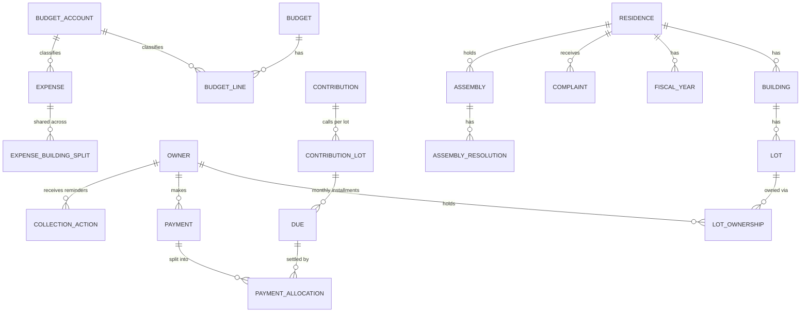

# Syndic App — Database Structure (Laravel)

Based on CDC-MA7314 (KHALLOUFI NEGOCE). Covers all 12 modules, roles, audit, AI/MCP and the showcase site.

---

## 1. Core design decisions

| Decision | Why |
|---|---|
| **Never store a balance as the source of truth.** Store *dues* (what is owed, per lot per month) and *payment allocations* (what was paid against each due). Balance = Σ dues − Σ validated allocations. | One source of truth, so the co-owner portal, unpaid report, treasury, WhatsApp bot and MCP all show the same number. |
| **`dues` = monthly installment per lot**, generated from a contribution. `amount_paid` and `status` are a *cache* recomputed by a service. | Fast unpaid lists, partial payments, "oldest first" allocation, formal notice at > 12 months. |
| **`payment_allocations`** link one payment to many dues. | One payment can settle 2024 + 2025 + 2026. |
| **`lot_ownerships`** (lot ↔ owner, with dates and share %). | Indivision, sale history, "who owned this lot when". Owners are *not* tied to one residence. |
| **`residence_id` denormalized on every business table.** | Easy global scope + per-residence permissions + fast filters. |
| **Money = `decimal(12,2)`**, cast to `Money`/string in Eloquent. | No float errors. Rounding adjustment on monthly split (largest-remainder). |
| **Snapshots** (`contribution_lots` stores tantième + coefficient used; treasury statements store totals). | Later tantième changes must not rewrite past calls. |
| **Payments, receipts, audit are never hard-deleted.** Payments are *cancelled* (status + reason). Other tables use `softDeletes` (the "corbeille"). | Traceability and restore. |
| **Single `approval_requests` table** for "deletion needs validation" and "AI sensitive action needs validation". | One workflow, one inbox. |
| **Translatable JSON columns** (`fr`/`ar`) only for labels users see (complaint types, accounts, site content, announcements). | Avoids duplicating tables per language. |

### Suggested packages
`spatie/laravel-permission` (roles + per-module permissions), `spatie/laravel-activitylog` (audit log), `spatie/laravel-medialibrary` (justificatifs, photos), `spatie/laravel-translatable` (fr/ar), `maatwebsite/excel` (import/export), a PDF engine (dompdf / browsershot) for documents, an MCP package or custom server for module 11.

---

## 2. Entity overview



---

## 3. Enums (`app/Enums`)

All are string-backed PHP enums, stored as `string` columns (not DB `enum`, so adding a case never needs a migration). Add a `label()` method (fr/ar via `__()`) through a shared trait.

```php
<?php
namespace App\Enums;

trait HasLabel {
    public function label(): string { return __('enums.'.static::class.'.'.$this->value); }
    public static function options(): array {
        return array_map(fn ($c) => ['value' => $c->value, 'label' => $c->label()], self::cases());
    }
}

// --- Module 1 : Residences & lots
enum LotType: string { use HasLabel;
    case Apartment='apartment'; case Duplex='duplex'; case Shop='shop';
    case Office='office'; case House='house'; case LargeSurface='large_surface'; case Other='other'; }
enum ParkingStatus: string { use HasLabel; case Yes='yes'; case No='no'; case Common='common'; }
enum AnnexType: string { use HasLabel; case Parking='parking'; case Box='box'; }
enum FiscalYearStatus: string { use HasLabel; case Open='open'; case Closed='closed'; }

// --- Module 2 : Owners
enum OwnerType: string { use HasLabel; case Individual='individual'; case Company='company'; }
enum OwnershipChangeReason: string { use HasLabel;
    case Initial='initial'; case Sale='sale'; case Inheritance='inheritance'; case Donation='donation'; case Other='other'; }

// --- Module 3 : Contributions
enum ContributionType: string { use HasLabel; case Syndic='syndic'; case Exceptional='exceptional'; }
enum CalculationMode: string { use HasLabel; case Fixed='fixed'; case Tantieme='tantieme'; }
enum ContributionStatus: string { use HasLabel; case Draft='draft'; case Published='published'; case Cancelled='cancelled'; }
enum DueStatus: string { use HasLabel; case Unpaid='unpaid'; case Partial='partial'; case Paid='paid'; case Cancelled='cancelled'; }

// --- Module 4 : Payments
enum PaymentMethod: string { use HasLabel;
    case Cheque='cheque'; case Transfer='transfer'; case Deposit='deposit'; case Cash='cash'; case Effet='effet'; }
enum PaymentStatus: string { use HasLabel;
    case Pending='pending';      // declared by co-owner, waiting for manager
    case Validated='validated';
    case Rejected='rejected';
    case Cancelled='cancelled'; }
enum PaymentSource: string { use HasLabel; case BackOffice='back_office'; case OwnerPortal='owner_portal'; case Whatsapp='whatsapp'; case Import='import'; }
enum AllocationMode: string { use HasLabel; case Auto='auto'; case Manual='manual'; }

// --- Module 5 : Budgets & expenses
enum BudgetType: string { use HasLabel; case Forecast='forecast'; case OffBudget='off_budget'; }
enum BudgetKind: string { use HasLabel; case Operating='operating'; case Investment='investment'; }
enum BudgetStatus: string { use HasLabel; case Draft='draft'; case Approved='approved'; case Closed='closed'; }
enum ExpenseKind: string { use HasLabel; case Expense='expense'; case Intervention='intervention'; }
enum ExpenseStatus: string { use HasLabel; case Recorded='recorded'; case Paid='paid'; case Cancelled='cancelled'; }

// --- Module 6 : Treasury
enum TreasuryStatus: string { use HasLabel; case Draft='draft'; case Validated='validated'; }

// --- Module 7 : Collection
enum CollectionActionType: string { use HasLabel; case Reminder='reminder'; case FormalNotice='formal_notice'; case LawyerReferral='lawyer_referral'; }
enum NotificationChannel: string { use HasLabel; case Whatsapp='whatsapp'; case Email='email'; case Letter='letter'; case Sms='sms'; }
enum DeliveryStatus: string { use HasLabel; case Queued='queued'; case Sent='sent'; case Delivered='delivered'; case Failed='failed'; }
enum LawyerCaseStatus: string { use HasLabel; case ToTransmit='to_transmit'; case Transmitted='transmitted'; case InProgress='in_progress'; case Closed='closed'; }

// --- Module 8 : Complaints
enum ComplaintStatus: string { use HasLabel; case New='new'; case InProgress='in_progress'; case Resolved='resolved'; }
enum ComplaintSource: string { use HasLabel; case Manager='manager'; case OwnerPortal='owner_portal'; case Whatsapp='whatsapp'; }
enum ComplaintPriority: string { use HasLabel; case Low='low'; case Normal='normal'; case Urgent='urgent'; }
enum AuthorType: string { use HasLabel; case Staff='staff'; case Owner='owner'; case Bot='bot'; }

// --- Module 9 : Assemblies
enum AssemblyType: string { use HasLabel; case Ordinary='ordinary'; case Extraordinary='extraordinary'; }
enum AssemblyStatus: string { use HasLabel; case Draft='draft'; case Convened='convened'; case Held='held'; case Closed='closed'; }
enum AttendanceType: string { use HasLabel; case Present='present'; case Represented='represented'; case Absent='absent'; }
enum MajorityRule: string { use HasLabel; case Simple='simple'; case TwoThirds='two_thirds'; case Unanimity='unanimity'; }
enum ResolutionResult: string { use HasLabel; case Pending='pending'; case Adopted='adopted'; case Rejected='rejected'; }
enum VoteChoice: string { use HasLabel; case For='for'; case Against='against'; case Abstain='abstain'; }

// --- Documents / users / AI
enum DocumentType: string { use HasLabel;
    case Receipt='receipt'; case FundCall='fund_call'; case OwnerStatement='owner_statement';
    case UnpaidStatement='unpaid_statement'; case ResidenceStatement='residence_statement';
    case Reminder='reminder'; case FormalNotice='formal_notice'; case LawyerList='lawyer_list';
    case AssemblyNotice='assembly_notice'; case AttendanceList='attendance_list'; case AssemblyMinutes='assembly_minutes';
    case Quitus='quitus'; case FinancialReport='financial_report'; case MoralReport='moral_report';
    case BudgetForecast='budget_forecast'; case ExpenseStatement='expense_statement'; case BudgetVsActual='budget_vs_actual';
    case TreasuryStatement='treasury_statement';
    case Regulation='regulation'; case Other='other'; }
enum DocumentVisibility: string { use HasLabel; case Staff='staff'; case Owner='owner'; case Residence='residence'; }
enum UserType: string { use HasLabel; case Staff='staff'; case Owner='owner'; }
enum ApprovalAction: string { use HasLabel; case Delete='delete'; case SendReminders='send_reminders'; case UpdateRecord='update_record'; case Other='other'; }
enum ApprovalStatus: string { use HasLabel; case Pending='pending'; case Approved='approved'; case Rejected='rejected'; case Expired='expired'; }
enum ApiChannel: string { use HasLabel; case Mcp='mcp'; case Api='api'; case WhatsappAgent='whatsapp_agent'; }
enum ConversationStatus: string { use HasLabel; case Bot='bot'; case HandedOff='handed_off'; case Closed='closed'; }
enum MessageDirection: string { use HasLabel; case In='in'; case Out='out'; }
enum InquiryType: string { use HasLabel; case Contact='contact'; case Quote='quote'; }
enum InquiryStatus: string { use HasLabel; case New='new'; case Contacted='contacted'; case Closed='closed'; }
enum SequenceType: string { use HasLabel; case Receipt='receipt'; case FundCall='fund_call'; case Notice='notice'; case Quitus='quitus'; case Minutes='minutes'; }
```

---

## 4. Migrations

One migration file per block, **in this order** (foreign-key dependencies). Only the `up()` bodies are shown. Conventions used below:

- `$t->id()` = bigint PK; `$t->softDeletes()` and `$t->timestamps()` where stated (`ST` = both).
- `created_by` / `updated_by` = nullable `foreignId('...')->constrained('users')->nullOnDelete()` (add through a trait/macro `$t->audit()`).

### 4.1 Users, scope, lookups

```php
// users (modify default table)
Schema::table('users', function (Blueprint $t) {
    $t->string('type')->default('staff');            // UserType
    $t->string('phone')->nullable();
    $t->string('locale', 2)->default('fr');          // fr | ar
    $t->boolean('is_active')->default(true);
    $t->boolean('can_access_all_residences')->default(false);
    $t->timestamp('last_login_at')->nullable();
    $t->softDeletes();
});

Schema::create('banks', function (Blueprint $t) {
    $t->id(); $t->string('name')->unique(); $t->string('short_code', 20)->nullable();
    $t->boolean('is_active')->default(true); $t->timestamps();
});

Schema::create('suppliers', function (Blueprint $t) {
    $t->id(); $t->string('name'); $t->string('category')->nullable();
    $t->string('phone')->nullable(); $t->string('email')->nullable();
    $t->string('ice')->nullable(); $t->text('address')->nullable(); $t->text('notes')->nullable();
    $t->boolean('is_active')->default(true); $t->timestamps(); $t->softDeletes();
});

Schema::create('number_sequences', function (Blueprint $t) {   // numbered receipts, quitus...
    $t->id();
    $t->foreignId('residence_id')->nullable()->constrained()->cascadeOnDelete();
    $t->string('type');                                // SequenceType
    $t->unsignedSmallInteger('year');
    $t->unsignedInteger('last_number')->default(0);
    $t->unique(['residence_id', 'type', 'year']);
    $t->timestamps();
});
// Increment inside a DB transaction with lockForUpdate() to guarantee gap-free numbering.
```

### 4.2 Residences, buildings, lots

```php
Schema::create('residences', function (Blueprint $t) {
    $t->id();
    $t->string('name');                                // Résidence Les Jardins 1
    $t->string('syndicate_name');                      // Syndicat des copropriétaires ...
    $t->string('city'); $t->text('address')->nullable();
    $t->string('calculation_mode')->default('tantieme');   // CalculationMode (per residence)
    $t->decimal('total_tantiemes', 14, 4)->nullable(); // expected total, used for the control
    $t->unsignedTinyInteger('fiscal_start_month')->default(9);
    $t->string('currency', 3)->default('MAD');
    $t->string('letterhead_path')->nullable();         // header used on every PDF
    $t->string('logo_path')->nullable();
    $t->json('legal_info')->nullable();                // ICE, RC, bank details printed on documents
    $t->boolean('is_active')->default(true);
    $t->audit(); $t->timestamps(); $t->softDeletes();
});

Schema::create('residence_user', function (Blueprint $t) {      // manager ↔ residences scope
    $t->id();
    $t->foreignId('residence_id')->constrained()->cascadeOnDelete();
    $t->foreignId('user_id')->constrained()->cascadeOnDelete();
    $t->unique(['residence_id', 'user_id']);
});

Schema::create('fiscal_years', function (Blueprint $t) {        // période d'exercice
    $t->id();
    $t->foreignId('residence_id')->constrained()->cascadeOnDelete();
    $t->string('name');                                // 2026/2027
    $t->date('starts_on'); $t->date('ends_on');
    $t->string('status')->default('open');             // FiscalYearStatus
    $t->timestamps(); $t->softDeletes();
    $t->unique(['residence_id', 'starts_on']);
});

Schema::create('buildings', function (Blueprint $t) {
    $t->id();
    $t->foreignId('residence_id')->constrained()->cascadeOnDelete();
    $t->string('number');                              // A, B, 12...
    $t->string('label')->nullable();
    $t->unsignedSmallInteger('floors')->nullable();
    $t->timestamps(); $t->softDeletes();
    $t->unique(['residence_id', 'number']);
});

Schema::create('lots', function (Blueprint $t) {
    $t->id();
    $t->foreignId('residence_id')->constrained()->cascadeOnDelete();
    $t->foreignId('building_id')->constrained();
    $t->string('number');                              // N° local
    $t->string('type');                                // LotType
    $t->decimal('surface', 10, 2)->nullable();         // m²
    $t->decimal('tantieme', 14, 4)->default(0);
    $t->string('land_title_no')->nullable();           // N° titre foncier
    $t->string('parking_status')->default('no');       // ParkingStatus
    $t->boolean('has_box')->default(false);
    $t->unsignedSmallInteger('floor')->nullable();
    $t->text('notes')->nullable();
    $t->boolean('is_active')->default(true);           // archivage
    $t->timestamp('archived_at')->nullable();
    $t->audit(); $t->timestamps(); $t->softDeletes();
    $t->unique(['building_id', 'number']);
    $t->index(['residence_id', 'type']);
});

Schema::create('lot_annexes', function (Blueprint $t) {         // several parkings / boxes per lot
    $t->id();
    $t->foreignId('lot_id')->constrained()->cascadeOnDelete();
    $t->string('type');                                // AnnexType
    $t->string('number');
    $t->timestamps();
    $t->unique(['lot_id', 'type', 'number']);
});
```

### 4.3 Owners and ownership history

```php
Schema::create('owners', function (Blueprint $t) {
    $t->id();
    $t->string('type')->default('individual');         // OwnerType
    $t->string('first_name')->nullable(); $t->string('last_name')->nullable();
    $t->string('company_name')->nullable();
    $t->string('identity_number')->nullable()->index();// CIN, or RC for a company
    $t->foreignId('user_id')->nullable()->unique()->constrained()->nullOnDelete(); // portal login
    $t->boolean('portal_enabled')->default(false);
    $t->string('preferred_locale', 2)->default('fr');
    $t->text('internal_notes')->nullable();
    $t->audit(); $t->timestamps(); $t->softDeletes();
});

Schema::create('owner_phones', function (Blueprint $t) {
    $t->id();
    $t->foreignId('owner_id')->constrained()->cascadeOnDelete();
    $t->string('number', 20);                          // store E.164 (+2126...) → WhatsApp lookup
    $t->boolean('is_whatsapp')->default(false);
    $t->boolean('is_primary')->default(false);
    $t->timestamps();
    $t->index('number');
    $t->unique(['owner_id', 'number']);
});

Schema::create('owner_emails', function (Blueprint $t) {
    $t->id();
    $t->foreignId('owner_id')->constrained()->cascadeOnDelete();
    $t->string('email');
    $t->boolean('is_primary')->default(false);
    $t->timestamps();
    $t->unique(['owner_id', 'email']);
});

Schema::create('lot_ownerships', function (Blueprint $t) {
    $t->id();
    $t->foreignId('lot_id')->constrained()->cascadeOnDelete();
    $t->foreignId('owner_id')->constrained();
    $t->decimal('share_percent', 5, 2)->default(100);  // indivision
    $t->boolean('is_billing_contact')->default(true);  // who receives calls/reminders
    $t->date('started_on');
    $t->date('ended_on')->nullable();                  // null = current owner
    $t->string('change_reason')->default('initial');   // OwnershipChangeReason
    $t->text('notes')->nullable();
    $t->audit(); $t->timestamps();
    $t->unique(['lot_id', 'owner_id', 'started_on']);
    $t->index(['owner_id', 'ended_on']);
});
// Rule (service): Σ share_percent of current rows per lot = 100.
```

### 4.4 Contributions and dues

```php
Schema::create('contributions', function (Blueprint $t) {
    $t->id();
    $t->foreignId('residence_id')->constrained()->cascadeOnDelete();
    $t->foreignId('fiscal_year_id')->nullable()->constrained();
    $t->string('type');                                // ContributionType
    $t->string('name');                                // Cotisation syndic année 2026
    $t->date('starts_on'); $t->date('ends_on');
    $t->string('calculation_mode');                    // CalculationMode (copied from residence, overridable)
    $t->decimal('annual_budget', 14, 2)->nullable();   // tantième mode
    $t->decimal('coefficient', 18, 8)->nullable();     // annual_budget / total tantièmes (snapshot)
    $t->decimal('monthly_total', 14, 2)->nullable();
    $t->decimal('annual_total', 14, 2)->nullable();
    $t->boolean('applies_to_all_buildings')->default(true);
    $t->string('status')->default('draft');           // ContributionStatus
    $t->timestamp('published_at')->nullable();
    $t->audit(); $t->timestamps(); $t->softDeletes();
    $t->index(['residence_id', 'type', 'starts_on']);
});

Schema::create('contribution_buildings', function (Blueprint $t) {   // exceptional → some buildings only
    $t->id();
    $t->foreignId('contribution_id')->constrained()->cascadeOnDelete();
    $t->foreignId('building_id')->constrained()->cascadeOnDelete();
    $t->unique(['contribution_id', 'building_id']);
});

Schema::create('contribution_fixed_rates', function (Blueprint $t) { // fixed mode grid
    $t->id();
    $t->foreignId('contribution_id')->constrained()->cascadeOnDelete();
    $t->string('lot_type');                            // LotType
    $t->decimal('min_surface', 10, 2)->nullable();
    $t->decimal('max_surface', 10, 2)->nullable();
    $t->decimal('monthly_amount', 12, 2);
    $t->timestamps();
});

Schema::create('contribution_lots', function (Blueprint $t) {    // "appel de fonds" per lot
    $t->id();
    $t->foreignId('contribution_id')->constrained()->cascadeOnDelete();
    $t->foreignId('residence_id')->constrained();
    $t->foreignId('lot_id')->constrained();
    $t->decimal('tantieme_snapshot', 14, 4)->nullable();
    $t->decimal('surface_snapshot', 10, 2)->nullable();
    $t->decimal('annual_amount', 12, 2);
    $t->decimal('monthly_amount', 12, 2);              // display value; real split is in dues
    $t->timestamps();
    $t->unique(['contribution_id', 'lot_id']);
});

Schema::create('dues', function (Blueprint $t) {                 // ONE ROW PER LOT PER MONTH
    $t->id();
    $t->foreignId('residence_id')->constrained();
    $t->foreignId('contribution_lot_id')->constrained()->cascadeOnDelete();
    $t->foreignId('lot_id')->constrained();
    $t->foreignId('owner_id')->nullable()->constrained(); // billing owner at generation time
    $t->date('period_start'); $t->date('period_end');
    $t->unsignedTinyInteger('days');                   // prorata basis
    $t->decimal('amount', 12, 2);                      // after rounding adjustment (Σ = annual exact)
    $t->decimal('amount_paid', 12, 2)->default(0);     // cache (recomputed by service)
    $t->date('due_date');
    $t->string('status')->default('unpaid');           // DueStatus (cache)
    $t->timestamps();
    $t->unique(['contribution_lot_id', 'period_start']);
    $t->index(['residence_id', 'status', 'due_date']);
    $t->index(['lot_id', 'status']);
    $t->index(['owner_id', 'status']);
});
```

### 4.5 Banks, payments, allocations

```php
Schema::create('bank_accounts', function (Blueprint $t) {        // residence's own account(s)
    $t->id();
    $t->foreignId('residence_id')->constrained()->cascadeOnDelete();
    $t->foreignId('bank_id')->constrained();
    $t->string('label');
    $t->string('account_number')->nullable();          // RIB (mask in UI)
    $t->decimal('opening_balance', 14, 2)->default(0);
    $t->date('opening_date')->nullable();
    $t->boolean('is_active')->default(true);
    $t->timestamps(); $t->softDeletes();
});

Schema::create('payments', function (Blueprint $t) {
    $t->id();
    $t->foreignId('residence_id')->constrained();
    $t->foreignId('owner_id')->constrained();
    $t->foreignId('lot_id')->nullable()->constrained();// null if one payment covers several lots
    $t->foreignId('bank_account_id')->nullable()->constrained(); // where the money lands
    $t->foreignId('bank_id')->nullable()->constrained();         // issuer bank of cheque/effet
    $t->date('paid_on');
    $t->string('method');                              // PaymentMethod
    $t->string('document_number')->nullable();         // required if cheque/effet (validation rule)
    $t->decimal('amount', 12, 2);
    $t->string('allocation_mode')->default('auto');    // AllocationMode
    $t->string('status')->default('validated');        // PaymentStatus
    $t->string('source')->default('back_office');      // PaymentSource
    $t->string('receipt_number')->nullable()->unique();// REC-2026-000123 (assigned on validation)
    $t->uuid('verification_token')->unique();          // behind the receipt QR code
    $t->timestamp('receipt_sent_at')->nullable();
    $t->foreignId('validated_by')->nullable()->constrained('users')->nullOnDelete();
    $t->timestamp('validated_at')->nullable();
    $t->text('rejection_reason')->nullable();
    $t->foreignId('cancelled_by')->nullable()->constrained('users')->nullOnDelete();
    $t->timestamp('cancelled_at')->nullable();
    $t->text('cancellation_reason')->nullable();
    $t->text('notes')->nullable();
    $t->audit(); $t->timestamps();                     // NO softDeletes: cancel, never delete
    $t->index(['residence_id', 'paid_on']);
    $t->index(['owner_id', 'status']);
});
// Proof of payment (owner declaration) → medialibrary collection "proof" on Payment.

Schema::create('payment_allocations', function (Blueprint $t) {
    $t->id();
    $t->foreignId('payment_id')->constrained()->cascadeOnDelete();
    $t->foreignId('due_id')->constrained();
    $t->decimal('amount', 12, 2);
    $t->timestamps();
    $t->unique(['payment_id', 'due_id']);
    $t->index('due_id');
});
// Rule: Σ allocations of a payment ≤ payment.amount (remainder = advance/credit).
// Cancelling a payment keeps its allocations; queries and the dues cache only count payments with status = validated.
```

### 4.6 Budgets and expenses

```php
Schema::create('budget_accounts', function (Blueprint $t) {      // Compte → Sous-compte (tree)
    $t->id();
    $t->foreignId('residence_id')->nullable()->constrained()->cascadeOnDelete(); // null = shared template
    $t->foreignId('parent_id')->nullable()->constrained('budget_accounts')->cascadeOnDelete();
    $t->string('code', 20)->nullable();
    $t->json('name');                                  // {"fr": "...", "ar": "..."}
    $t->boolean('is_active')->default(true);
    $t->timestamps(); $t->softDeletes();
});

Schema::create('budgets', function (Blueprint $t) {
    $t->id();
    $t->foreignId('residence_id')->constrained()->cascadeOnDelete();
    $t->foreignId('fiscal_year_id')->nullable()->constrained();
    $t->string('type');                                // BudgetType
    $t->string('kind');                                // BudgetKind
    $t->string('name');
    $t->string('status')->default('draft');            // BudgetStatus
    $t->decimal('total_monthly', 14, 2)->default(0);   // cache
    $t->decimal('total_annual', 14, 2)->default(0);    // cache
    $t->timestamp('approved_at')->nullable();
    $t->audit(); $t->timestamps(); $t->softDeletes();
});

Schema::create('budget_lines', function (Blueprint $t) {
    $t->id();
    $t->foreignId('budget_id')->constrained()->cascadeOnDelete();
    $t->foreignId('account_id')->constrained('budget_accounts');       // parent account
    $t->foreignId('sub_account_id')->nullable()->constrained('budget_accounts');
    $t->string('label')->nullable();
    $t->decimal('quantity', 10, 2)->default(1);
    $t->decimal('unit_price', 12, 2);
    $t->decimal('monthly_amount', 12, 2);              // computed: quantity × unit_price
    $t->decimal('annual_amount', 12, 2);               // computed: monthly × 12
    $t->timestamps();
    $t->index(['budget_id', 'account_id']);
});

Schema::create('expenses', function (Blueprint $t) {
    $t->id();
    $t->foreignId('residence_id')->constrained();
    $t->foreignId('budget_id')->nullable()->constrained();             // null if off-budget
    $t->foreignId('account_id')->nullable()->constrained('budget_accounts');
    $t->foreignId('sub_account_id')->nullable()->constrained('budget_accounts');
    $t->foreignId('supplier_id')->nullable()->constrained();
    $t->foreignId('bank_account_id')->nullable()->constrained();
    $t->foreignId('bank_id')->nullable()->constrained();
    $t->date('spent_on');
    $t->string('kind')->default('expense');            // ExpenseKind (intervention may be 0)
    $t->string('budget_type')->default('forecast');    // BudgetType
    $t->string('description');
    $t->decimal('amount', 12, 2)->default(0);
    $t->string('payment_method')->nullable();          // PaymentMethod
    $t->string('document_number')->nullable();
    $t->string('invoice_number')->nullable();
    $t->string('status')->default('paid');             // ExpenseStatus
    $t->text('notes')->nullable();
    $t->audit(); $t->timestamps(); $t->softDeletes();
    $t->index(['residence_id', 'spent_on']);
    $t->index(['budget_id', 'account_id']);
});
// Invoice / photo → medialibrary collection "invoice" on Expense.

Schema::create('expense_building_splits', function (Blueprint $t) {  // one expense shared A/B/C
    $t->id();
    $t->foreignId('expense_id')->constrained()->cascadeOnDelete();
    $t->foreignId('building_id')->constrained();
    $t->decimal('amount', 12, 2);
    $t->unique(['expense_id', 'building_id']);
});
// Rule: Σ splits = expense.amount. Over-budget alert = Σ expenses per account > Σ budget_lines per account.
```

### 4.7 Treasury

```php
Schema::create('treasury_statements', function (Blueprint $t) {
    $t->id();
    $t->foreignId('residence_id')->constrained();
    $t->foreignId('bank_account_id')->nullable()->constrained();
    $t->date('period_start'); $t->date('period_end');
    $t->decimal('opening_balance', 14, 2);
    $t->decimal('total_contributions', 14, 2);         // snapshot of validated payments in period
    $t->decimal('total_expenses', 14, 2);              // snapshot of expenses in period
    $t->decimal('computed_closing_balance', 14, 2);
    $t->decimal('bank_closing_balance', 14, 2)->nullable(); // from the bank statement
    $t->decimal('difference', 14, 2)->nullable();      // computed − bank → reconciliation
    $t->string('status')->default('draft');           // TreasuryStatus
    $t->text('notes')->nullable();
    $t->audit(); $t->timestamps(); $t->softDeletes();
    $t->unique(['residence_id', 'bank_account_id', 'period_start', 'period_end'], 'treasury_period_unique');
});
```

### 4.8 Documents and templates

```php
Schema::create('documents', function (Blueprint $t) {            // every generated / official file
    $t->id();
    $t->foreignId('residence_id')->nullable()->constrained();
    $t->nullableMorphs('documentable');                // Payment, Due, Assembly, Owner, Contribution...
    $t->string('type');                                // DocumentType
    $t->string('number')->nullable()->index();
    $t->string('title');
    $t->string('locale', 2)->default('fr');
    $t->string('visibility')->default('staff');        // DocumentVisibility (owner portal access)
    $t->string('disk')->default('private');
    $t->string('path');
    $t->string('mime')->default('application/pdf');
    $t->unsignedBigInteger('size')->nullable();
    $t->json('meta')->nullable();                      // filters/period used to generate it
    $t->foreignId('generated_by')->nullable()->constrained('users')->nullOnDelete();
    $t->timestamp('generated_at')->nullable();
    $t->timestamps(); $t->softDeletes();
    $t->index(['residence_id', 'type']);
});

Schema::create('document_templates', function (Blueprint $t) {   // mise en demeure, PV, quitus models
    $t->id();
    $t->foreignId('residence_id')->nullable()->constrained()->cascadeOnDelete(); // null = default
    $t->string('type');                                // DocumentType
    $t->string('locale', 2)->default('fr');
    $t->string('name');
    $t->longText('body');                              // Blade/HTML with {{ placeholders }}
    $t->boolean('is_active')->default(true);
    $t->timestamps(); $t->softDeletes();
});
```

### 4.9 Collection (recouvrement)

```php
Schema::create('collection_actions', function (Blueprint $t) {   // history of all relances
    $t->id();
    $t->foreignId('residence_id')->constrained();
    $t->foreignId('owner_id')->constrained();
    $t->foreignId('lot_id')->nullable()->constrained();
    $t->string('type');                                // CollectionActionType
    $t->string('channel');                             // NotificationChannel
    $t->string('status')->default('queued');           // DeliveryStatus
    $t->decimal('amount_due', 12, 2);                  // snapshot at send time
    $t->date('oldest_due_date')->nullable();
    $t->foreignId('document_id')->nullable()->constrained();
    $t->foreignId('sent_by')->nullable()->constrained('users')->nullOnDelete(); // null = scheduler
    $t->timestamp('sent_at')->nullable();
    $t->string('provider_message_id')->nullable();     // WhatsApp / mail id
    $t->text('error')->nullable();
    $t->timestamps();
    $t->index(['owner_id', 'type', 'sent_at']);
    $t->index(['residence_id', 'sent_at']);
});

Schema::create('lawyer_cases', function (Blueprint $t) {         // "liste pour avocat"
    $t->id();
    $t->foreignId('residence_id')->constrained();
    $t->foreignId('owner_id')->constrained();
    $t->foreignId('lot_id')->nullable()->constrained();
    $t->decimal('amount_claimed', 12, 2);
    $t->string('status')->default('to_transmit');      // LawyerCaseStatus
    $t->foreignId('formal_notice_action_id')->nullable()->constrained('collection_actions');
    $t->timestamp('exported_at')->nullable();
    $t->text('notes')->nullable();
    $t->audit(); $t->timestamps(); $t->softDeletes();
});
```

### 4.10 Complaints

```php
Schema::create('complaint_types', function (Blueprint $t) {      // configurable list
    $t->id();
    $t->foreignId('residence_id')->nullable()->constrained()->cascadeOnDelete();
    $t->json('name');                                  // {"fr": "Ascenseur", "ar": "..."}
    $t->unsignedSmallInteger('target_hours')->nullable(); // expected handling time
    $t->boolean('is_active')->default(true);
    $t->timestamps();
});

Schema::create('complaints', function (Blueprint $t) {
    $t->id();
    $t->string('reference')->unique();
    $t->foreignId('residence_id')->constrained();
    $t->foreignId('building_id')->nullable()->constrained();
    $t->foreignId('lot_id')->nullable()->constrained();
    $t->foreignId('owner_id')->nullable()->constrained();
    $t->foreignId('complaint_type_id')->constrained();
    $t->text('description');
    $t->string('status')->default('new');             // ComplaintStatus
    $t->string('source')->default('manager');          // ComplaintSource
    $t->string('priority')->default('normal');         // ComplaintPriority
    $t->foreignId('assigned_to')->nullable()->constrained('users')->nullOnDelete();
    $t->timestamp('opened_at')->useCurrent();          // automatic date + time
    $t->timestamp('resolved_at')->nullable();          // entered at closure
    $t->unsignedInteger('resolution_minutes')->nullable(); // cache → "délai de traitement"
    $t->text('client_feedback')->nullable();           // retour au client
    $t->timestamp('feedback_sent_at')->nullable();
    $t->audit(); $t->timestamps(); $t->softDeletes();
    $t->index(['residence_id', 'status']);
});
// Photos → medialibrary collection "photos" on Complaint.

Schema::create('complaint_messages', function (Blueprint $t) {
    $t->id();
    $t->foreignId('complaint_id')->constrained()->cascadeOnDelete();
    $t->string('author_type');                         // AuthorType
    $t->foreignId('user_id')->nullable()->constrained()->nullOnDelete();
    $t->foreignId('owner_id')->nullable()->constrained()->nullOnDelete();
    $t->text('body');
    $t->boolean('is_internal')->default(false);        // staff-only note
    $t->timestamps();
});
```

### 4.11 Assemblies and reports

```php
Schema::create('assemblies', function (Blueprint $t) {
    $t->id();
    $t->foreignId('residence_id')->constrained();
    $t->foreignId('fiscal_year_id')->nullable()->constrained();
    $t->string('type')->default('ordinary');           // AssemblyType
    $t->string('status')->default('draft');            // AssemblyStatus
    $t->string('title');
    $t->dateTime('scheduled_at');
    $t->string('location');
    $t->text('agenda')->nullable();                    // ordre du jour (free text / summary)
    $t->timestamp('convened_at')->nullable();
    $t->decimal('quorum_tantiemes', 14, 4)->nullable();
    $t->decimal('present_tantiemes', 14, 4)->nullable();   // cache
    $t->text('minutes_notes')->nullable();
    $t->audit(); $t->timestamps(); $t->softDeletes();
});

Schema::create('assembly_resolutions', function (Blueprint $t) {
    $t->id();
    $t->foreignId('assembly_id')->constrained()->cascadeOnDelete();
    $t->unsignedSmallInteger('position');
    $t->string('title');
    $t->text('description')->nullable();
    $t->string('majority_rule')->default('simple');    // MajorityRule
    $t->string('result')->default('pending');          // ResolutionResult
    $t->decimal('votes_for', 14, 4)->default(0);       // cache, in tantièmes
    $t->decimal('votes_against', 14, 4)->default(0);
    $t->decimal('votes_abstain', 14, 4)->default(0);
    $t->timestamps();
});

Schema::create('assembly_attendances', function (Blueprint $t) {
    $t->id();
    $t->foreignId('assembly_id')->constrained()->cascadeOnDelete();
    $t->foreignId('lot_id')->constrained();
    $t->foreignId('owner_id')->constrained();
    $t->string('attendance')->default('absent');       // AttendanceType
    $t->foreignId('proxy_owner_id')->nullable()->constrained('owners'); // procuration
    $t->decimal('tantieme_counted', 14, 4)->default(0);
    $t->boolean('signed')->default(false);
    $t->timestamps();
    $t->unique(['assembly_id', 'lot_id']);
});

Schema::create('resolution_votes', function (Blueprint $t) {
    $t->id();
    $t->foreignId('resolution_id')->constrained('assembly_resolutions')->cascadeOnDelete();
    $t->foreignId('lot_id')->constrained();
    $t->string('choice');                              // VoteChoice
    $t->decimal('weight', 14, 4);                      // tantième of the lot
    $t->timestamps();
    $t->unique(['resolution_id', 'lot_id']);
});

Schema::create('quitus_certificates', function (Blueprint $t) {  // إبراء الذمة
    $t->id();
    $t->foreignId('residence_id')->constrained();
    $t->foreignId('owner_id')->constrained();
    $t->foreignId('lot_id')->nullable()->constrained();
    $t->foreignId('fiscal_year_id')->nullable()->constrained();
    $t->string('number')->unique();
    $t->decimal('balance_at_issue', 12, 2)->default(0); // must be 0 (service rule)
    $t->date('issued_on');
    $t->foreignId('issued_by')->nullable()->constrained('users')->nullOnDelete();
    $t->foreignId('document_id')->nullable()->constrained();
    $t->timestamps();
});
// Financial / moral reports → rows in `documents` (type financial_report / moral_report).

Schema::create('announcements', function (Blueprint $t) {        // notes & informations
    $t->id();
    $t->foreignId('residence_id')->constrained();
    $t->foreignId('building_id')->nullable()->constrained();     // null = whole residence
    $t->json('title');                                 // fr / ar
    $t->json('body');
    $t->timestamp('published_at')->nullable();
    $t->timestamp('expires_at')->nullable();
    $t->json('notify_channels')->nullable();           // ["whatsapp","email"]
    $t->audit(); $t->timestamps(); $t->softDeletes();
});
```

### 4.12 Approvals, API keys, AI/WhatsApp, imports

```php
Schema::create('approval_requests', function (Blueprint $t) {    // deletion / sensitive AI actions
    $t->id();
    $t->foreignId('residence_id')->nullable()->constrained();
    $t->string('action');                              // ApprovalAction
    $t->nullableMorphs('subject');                     // record concerned
    $t->json('payload')->nullable();                   // what will be executed
    $t->string('status')->default('pending');          // ApprovalStatus
    $t->foreignId('requested_by')->nullable()->constrained('users')->nullOnDelete();
    $t->foreignId('requested_via_api_key_id')->nullable();       // FK added after api_keys
    $t->text('reason')->nullable();
    $t->foreignId('reviewed_by')->nullable()->constrained('users')->nullOnDelete();
    $t->timestamp('reviewed_at')->nullable();
    $t->text('review_note')->nullable();
    $t->timestamp('expires_at')->nullable();
    $t->timestamps();
    $t->index(['status', 'residence_id']);
});

Schema::create('api_keys', function (Blueprint $t) {             // MCP / API keys
    $t->id();
    $t->string('name');
    $t->string('prefix', 12)->index();
    $t->string('key_hash');                            // store only a hash, show the key once
    $t->json('abilities');                             // ["read:balances","read:unpaid","write:reminders"]
    $t->json('residence_ids')->nullable();             // scope; null = all allowed
    $t->boolean('requires_approval_for_writes')->default(true);
    $t->timestamp('last_used_at')->nullable();
    $t->timestamp('expires_at')->nullable();
    $t->timestamp('revoked_at')->nullable();
    $t->foreignId('created_by')->nullable()->constrained('users')->nullOnDelete();
    $t->timestamps();
});
Schema::table('approval_requests', fn (Blueprint $t) =>
    $t->foreign('requested_via_api_key_id')->references('id')->on('api_keys')->nullOnDelete());

Schema::create('api_audit_logs', function (Blueprint $t) {       // every MCP/API/agent exchange
    $t->id();
    $t->foreignId('api_key_id')->nullable()->constrained()->nullOnDelete();
    $t->string('channel');                             // ApiChannel
    $t->string('tool')->nullable();                    // MCP tool / endpoint
    $t->json('request')->nullable();
    $t->unsignedSmallInteger('response_status')->nullable();
    $t->json('response_summary')->nullable();
    $t->string('ip', 45)->nullable();
    $t->unsignedInteger('duration_ms')->nullable();
    $t->timestamp('created_at')->useCurrent();
    $t->index(['api_key_id', 'created_at']);
});

Schema::create('whatsapp_conversations', function (Blueprint $t) {
    $t->id();
    $t->string('phone', 20)->index();                  // E.164, matched to owner_phones.number
    $t->foreignId('owner_id')->nullable()->constrained()->nullOnDelete();
    $t->string('status')->default('bot');              // ConversationStatus
    $t->foreignId('assigned_to')->nullable()->constrained('users')->nullOnDelete(); // handoff
    $t->timestamp('last_message_at')->nullable();
    $t->timestamps();
});

Schema::create('whatsapp_messages', function (Blueprint $t) {
    $t->id();
    $t->foreignId('conversation_id')->constrained('whatsapp_conversations')->cascadeOnDelete();
    $t->string('direction');                           // MessageDirection
    $t->string('wa_message_id')->nullable()->unique();
    $t->text('body')->nullable();
    $t->json('payload')->nullable();                   // media, tool calls made by the agent
    $t->string('status')->nullable();                  // DeliveryStatus
    $t->timestamp('sent_at')->nullable();
    $t->timestamps();
});

Schema::create('import_batches', function (Blueprint $t) {       // Excel imports (lots, owners, opening balances)
    $t->id();
    $t->foreignId('residence_id')->nullable()->constrained();
    $t->string('type');                                // lots | owners | opening_balances ...
    $t->string('file_path');
    $t->string('status')->default('pending');
    $t->unsignedInteger('rows_total')->default(0);
    $t->unsignedInteger('rows_imported')->default(0);
    $t->json('errors')->nullable();
    $t->foreignId('created_by')->nullable()->constrained('users')->nullOnDelete();
    $t->timestamps();
});
```

### 4.13 Showcase website

```php
Schema::create('site_pages', function (Blueprint $t) {
    $t->id();
    $t->string('slug')->unique();                      // home, services, references, about, contact
    $t->json('title'); $t->json('content');            // fr / ar, editable from admin
    $t->json('seo')->nullable();                       // meta title / description
    $t->boolean('is_published')->default(true);
    $t->unsignedSmallInteger('position')->default(0);
    $t->timestamps();
});

Schema::create('site_references', function (Blueprint $t) {      // residences shown on "références"
    $t->id();
    $t->json('name'); $t->json('description')->nullable();
    $t->string('city')->nullable(); $t->unsignedSmallInteger('position')->default(0);
    $t->boolean('is_published')->default(true); $t->timestamps();
});

Schema::create('inquiries', function (Blueprint $t) {            // contact + quote requests
    $t->id();
    $t->string('type');                                // InquiryType
    $t->string('name'); $t->string('email')->nullable(); $t->string('phone')->nullable();
    $t->text('message')->nullable();
    $t->json('details')->nullable();                   // quote: residences count, lots, services wanted
    $t->string('status')->default('new');              // InquiryStatus
    $t->foreignId('handled_by')->nullable()->constrained('users')->nullOnDelete();
    $t->string('ip', 45)->nullable();
    $t->timestamps();
});

Schema::create('settings', function (Blueprint $t) {             // company name, contact, social links
    $t->string('key')->primary(); $t->json('value')->nullable(); $t->timestamps();
});
```

### 4.14 Audit log and soft-delete trash
- **Audit** (`activity_log`) comes from `spatie/laravel-activitylog`: add `LogsActivity` to every business model with `logAll()->logOnlyDirty()`.
- **Corbeille** = `SoftDeletes` + an admin screen that lists `onlyTrashed()` across models and restores. Deletion for non-admins → creates an `approval_requests` row (`action = delete`) instead of deleting.

---

## 5. Models and key relationships

| Model | Main relations |
|---|---|
| `Residence` | hasMany `Building`, `Lot`, `FiscalYear`, `Contribution`, `Budget`, `Expense`, `BankAccount`, `Complaint`, `Assembly`; belongsToMany `User` |
| `Building` | belongsTo `Residence`; hasMany `Lot` |
| `Lot` | belongsTo `Building`, `Residence`; hasMany `LotAnnex`, `LotOwnership`, `Due`; belongsToMany `Owner` (through `lot_ownerships`); `currentOwnerships()` scope `whereNull('ended_on')` |
| `Owner` | hasMany `OwnerPhone`, `OwnerEmail`, `LotOwnership`, `Payment`, `CollectionAction`; belongsTo `User`; `lots()` through current ownerships |
| `Contribution` | belongsTo `Residence`, `FiscalYear`; hasMany `ContributionLot`, `ContributionFixedRate`; belongsToMany `Building` |
| `ContributionLot` | belongsTo `Contribution`, `Lot`; hasMany `Due` |
| `Due` | belongsTo `Lot`, `Owner`, `ContributionLot`; hasMany `PaymentAllocation` |
| `Payment` | belongsTo `Owner`, `Lot`, `BankAccount`; hasMany `PaymentAllocation`; morphMany `Document`; media `proof` |
| `PaymentAllocation` | belongsTo `Payment`, `Due` |
| `Budget` | hasMany `BudgetLine`; belongsTo `Residence`, `FiscalYear` |
| `BudgetAccount` | self-referencing `parent` / `children` |
| `Expense` | belongsTo `Supplier`, `BudgetAccount`, `Budget`; hasMany `ExpenseBuildingSplit`; media `invoice` |
| `Complaint` | belongsTo `ComplaintType`, `Owner`, `Lot`; hasMany `ComplaintMessage`; media `photos` |
| `Assembly` | hasMany `AssemblyResolution`, `AssemblyAttendance`; resolution hasMany `ResolutionVote` |
| `ApprovalRequest` | morphTo `subject`; belongsTo `User` (requester / reviewer), `ApiKey` |

Casts: every status/type column → its enum (`'status' => DueStatus::class`), money → `decimal:2`, JSON columns → `array`/`AsArrayObject`.

Global scope `ResidenceScope` on all models with `residence_id`: restricts rows to `auth()->user()->residences` unless `can_access_all_residences`. For owners (portal), scope instead through `lot_ownerships`.

---

## 6. Queries and business rules that make "tracking everything" work

**Balance per owner / lot (single source of truth)**

```sql
SELECT d.lot_id,
       SUM(d.amount)                                   AS total_due,
       COALESCE(SUM(a.paid), 0)                        AS total_paid,
       SUM(d.amount) - COALESCE(SUM(a.paid), 0)        AS remaining
FROM dues d
LEFT JOIN (
    SELECT pa.due_id, SUM(pa.amount) AS paid
    FROM payment_allocations pa
    JOIN payments p ON p.id = pa.payment_id AND p.status = 'validated'
    GROUP BY pa.due_id
) a ON a.due_id = d.id
WHERE d.status != 'cancelled' AND d.period_start <= CURRENT_DATE
GROUP BY d.lot_id;
```
Create it as a DB view (`lot_balances`) and back an Eloquent model with it. `dues.amount_paid/status` are refreshed after every payment validation, cancellation or allocation change by a single `DueSettlementService`.

**Rules to enforce in services (inside DB transactions)**
1. **Tantième control:** Σ `lots.tantieme` per residence = `residences.total_tantiemes` (warn on mismatch, block publishing a contribution).
2. **Monthly split:** days-in-month prorata, largest-remainder rounding so Σ monthly dues = annual amount exactly.
3. **Auto allocation:** open dues of the owner's lots ordered by `period_start` ASC; leftover stays as credit (payment has Σ allocations < amount).
4. **Receipt:** assign `receipt_number` from `number_sequences` only when status becomes `validated`; QR points to `/verify/{verification_token}`.
5. **Cheque/effet:** `document_number` required (form-request rule).
6. **Cancellation:** status → `cancelled` + reason + user + timestamp, then recompute affected dues.
7. **Formal notice:** dues with `due_date < now() - 1 year` and `status != paid` → eligible for `formal_notice` → can create `lawyer_cases`.
8. **Month-end reminders:** scheduler command, one `collection_actions` row per owner/channel (idempotency: unique check on owner + month + type).
9. **Quitus:** only if remaining balance = 0 (store `balance_at_issue`).
10. **Ownership change:** close current `lot_ownerships` row (`ended_on`), open new one; future dues use the new owner, past dues keep `owner_id` for history.
11. **AI/MCP:** read tools query views only; write tools create `approval_requests`; every call writes `api_audit_logs`.

**Recommended extra indexes:** `owner_phones.number`, `dues(residence_id, status, due_date)`, `payments(residence_id, paid_on)`, `expenses(residence_id, spent_on)`, `collection_actions(owner_id, type, sent_at)`.

---

## 7. Suggested build order

1. Users/roles/permissions, banks, suppliers, `number_sequences`
2. Residences → fiscal years → buildings → lots (+ Excel import)
3. Owners → phones/emails → `lot_ownerships`
4. Contributions → `contribution_lots` → `dues` generator
5. Payments → allocations → receipts (PDF + QR) → `DueSettlementService`
6. Budgets → accounts → expenses → treasury
7. Collection (reminders, notices, lawyer list) + documents/templates
8. Complaints → assemblies/quitus → announcements
9. Owner portal (read-only views over steps 4–8)
10. API keys, approvals, audit, WhatsApp agent, MCP server
11. Showcase site tables

---

## 8. What I deliberately left out (add only if the client asks)
- Full double-entry accounting (explicitly out of scope in the CDC).
- Online card payments (out of scope), so there is no `transactions`/gateway table.
- Per-lot fee overrides/discounts: add `lot_fee_adjustments` later if the client needs exemptions.
- Late-payment penalties: not in the CDC; would be an extra `dues.penalty_amount` or a separate `penalties` table.
