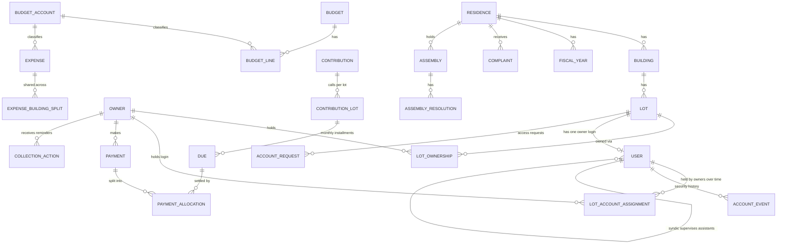

# Syndic App — Database Structure (Laravel)

Based on CDC-MA7314 (KHALLOUFI NEGOCE). Covers all 12 modules, roles, audit, AI/MCP and the showcase site.

> **Version 2 — this is the single source of truth.** It already includes the **one login account per lot** model (section 4.3b). Ignore any earlier version or addendum: staff and co-owners both log in through the single `users` table (one guard). An owner account is a `users` row with `type = owner` tied to one lot (`users.lot_id`). `owners` holds personal data and has no `user_id`.

---

## 1. Core design decisions

| Decision | Why |
|---|---|
| **Never store a balance as the source of truth.** Store *dues* (what is owed, per lot per month) and *payment allocations* (what was paid against each due). Balance = Σ dues − Σ validated allocations. | One source of truth, so the co-owner portal, unpaid report, treasury, WhatsApp bot and MCP all show the same number. |
| **`dues` = monthly installment per lot**, generated from a contribution. `amount_paid` and `status` are a *cache* recomputed by a service. | Fast unpaid lists, partial payments, "oldest first" allocation, formal notice at > 12 months. |
| **`payment_allocations`** link one payment to many dues. | One payment can settle 2024 + 2025 + 2026. |
| **`lot_ownerships`** (lot ↔ owner, with dates and share %). | Indivision, sale history, "who owned this lot when". Owners are *not* tied to one residence. |
| **One portal login per lot, stored in `users` (`type = owner`, `lot_id` unique).** Fixed username describing the property, the owner chooses the password. On a sale the account is reset and handed to the new owner; the row is never deleted. | Matches the client's access rule with one auth table and one guard. History lives in `lot_account_assignments` + `account_events`. |
| **Personal data stays in `owners` (+ phones, emails). `users` only holds credentials and account state.** | An owner with 3 lots has 3 logins; the login survives a sale, the person does not. |
| **`residence_id` denormalized on every business table.** | Easy global scope + per-residence permissions + fast filters. |
| **Money = `decimal(12,2)`**, cast to `Money`/string in Eloquent. | No float errors. Rounding adjustment on monthly split (largest-remainder). |
| **Snapshots** (`contribution_lots` stores tantième + coefficient used; treasury statements store totals). | Later tantième changes must not rewrite past calls. |
| **Payments, receipts, audit are never hard-deleted.** Payments are *cancelled* (status + reason). Other tables use `softDeletes` (the "corbeille"). | Traceability and restore. |
| **Single `approval_requests` table** for "deletion needs validation" and "AI sensitive action needs validation". | One workflow, one inbox. |
| **Translatable JSON columns** (`fr`/`ar`) only for labels users see (complaint types, accounts, site content, announcements). | Avoids duplicating tables per language. |

### Suggested packages
`spatie/laravel-permission` (roles + per-module permissions), `spatie/laravel-activitylog` (audit log), `spatie/laravel-medialibrary` (justificatifs, photos), `spatie/laravel-translatable` (fr/ar), `maatwebsite/excel` (import/export), a PDF engine (dompdf / browsershot) for documents, an MCP package or custom server for module 11.

---

## 2. Entity overview



---

## 3. Enums (`app/Enums`)

All are string-backed PHP enums, stored as `string` columns (not DB `enum`, so adding a case never needs a migration). Add a `label()` method (fr/ar via `__()`) through a shared trait.

```php
<?php
namespace App\Enums;

trait HasLabel {
    public function label(): string { return __('enums.'.static::class.'.'.$this->value); }
    public static function options(): array {
        return array_map(fn ($c) => ['value' => $c->value, 'label' => $c->label()], self::cases());
    }
}

// --- Module 1 : Residences & lots
enum LotType: string { use HasLabel;
    case Apartment='apartment'; case Duplex='duplex'; case Shop='shop';
    case Office='office'; case House='house'; case LargeSurface='large_surface'; case Other='other'; }
enum ParkingStatus: string { use HasLabel; case Yes='yes'; case No='no'; case Common='common'; }
enum AnnexType: string { use HasLabel; case Parking='parking'; case Box='box'; }
enum FiscalYearStatus: string { use HasLabel; case Open='open'; case Closed='closed'; }

// --- Module 2 : Owners
enum OwnerType: string { use HasLabel; case Individual='individual'; case Company='company'; }
enum OwnershipChangeReason: string { use HasLabel;
    case Initial='initial'; case PromoterSale='promoter_sale'; case Sale='sale'; case Inheritance='inheritance'; case Donation='donation'; case Other='other'; }

// --- Module 3 : Contributions
enum ContributionType: string { use HasLabel; case Syndic='syndic'; case Exceptional='exceptional'; }
enum CalculationMode: string { use HasLabel; case Fixed='fixed'; case Tantieme='tantieme'; }
enum ContributionStatus: string { use HasLabel; case Draft='draft'; case Published='published'; case Cancelled='cancelled'; }
enum DueStatus: string { use HasLabel; case Unpaid='unpaid'; case Partial='partial'; case Paid='paid'; case Cancelled='cancelled'; }

// --- Module 4 : Payments
enum PaymentMethod: string { use HasLabel;
    case Cheque='cheque'; case Transfer='transfer'; case Deposit='deposit'; case Cash='cash'; case Effet='effet';
    // labels: Chèque, Virement, Versement, Espèces, Effet
    public function requiresDocumentNumber(): bool { return in_array($this, [self::Cheque, self::Effet]); } }
enum PaymentStatus: string { use HasLabel;
    case Pending='pending';      // declared by co-owner, waiting for staff validation
    case Validated='validated';
    case Rejected='rejected';
    case Cancelled='cancelled'; }
enum PaymentSource: string { use HasLabel; case BackOffice='back_office'; case OwnerPortal='owner_portal'; case Whatsapp='whatsapp'; case Import='import'; }
enum AllocationMode: string { use HasLabel; case Auto='auto'; case Manual='manual'; }

// --- Module 5 : Budgets & expenses
enum BudgetType: string { use HasLabel; case Forecast='forecast'; case OffBudget='off_budget'; }
enum BudgetKind: string { use HasLabel; case Operating='operating'; case Investment='investment'; }
enum BudgetStatus: string { use HasLabel; case Draft='draft'; case Approved='approved'; case Closed='closed'; }
enum ExpenseKind: string { use HasLabel; case Expense='expense'; case Intervention='intervention'; }
enum ExpenseStatus: string { use HasLabel; case Recorded='recorded'; case Paid='paid'; case Cancelled='cancelled'; }

// --- Module 6 : Treasury
enum TreasuryStatus: string { use HasLabel; case Draft='draft'; case Validated='validated'; }

// --- Module 7 : Collection
enum CollectionActionType: string { use HasLabel; case Reminder='reminder'; case FormalNotice='formal_notice'; case LawyerReferral='lawyer_referral'; }
enum NotificationChannel: string { use HasLabel; case Whatsapp='whatsapp'; case Email='email'; case Letter='letter'; case Sms='sms'; }
enum DeliveryStatus: string { use HasLabel; case Queued='queued'; case Sent='sent'; case Delivered='delivered'; case Failed='failed'; }
enum LawyerCaseStatus: string { use HasLabel; case ToTransmit='to_transmit'; case Transmitted='transmitted'; case InProgress='in_progress'; case Closed='closed'; }

// --- Module 8 : Complaints
enum ComplaintStatus: string { use HasLabel; case New='new'; case InProgress='in_progress'; case Resolved='resolved'; }
enum ComplaintSource: string { use HasLabel; case Staff='staff'; case OwnerPortal='owner_portal'; case Whatsapp='whatsapp'; }
enum ComplaintPriority: string { use HasLabel; case Low='low'; case Normal='normal'; case Urgent='urgent'; }
enum AuthorType: string { use HasLabel; case Staff='staff'; case Owner='owner'; case Bot='bot'; }

// --- Module 9 : Assemblies
enum AssemblyType: string { use HasLabel; case Ordinary='ordinary'; case Extraordinary='extraordinary'; }
enum AssemblyStatus: string { use HasLabel; case Draft='draft'; case Convened='convened'; case Held='held'; case Closed='closed'; }
enum AttendanceType: string { use HasLabel; case Present='present'; case Represented='represented'; case Absent='absent'; }
enum MajorityRule: string { use HasLabel; case Simple='simple'; case TwoThirds='two_thirds'; case Unanimity='unanimity'; }
enum ResolutionResult: string { use HasLabel; case Pending='pending'; case Adopted='adopted'; case Rejected='rejected'; }
enum VoteChoice: string { use HasLabel; case For='for'; case Against='against'; case Abstain='abstain'; }

// --- Documents / users / AI
enum DocumentType: string { use HasLabel;
    case Receipt='receipt'; case FundCall='fund_call'; case OwnerStatement='owner_statement';
    case UnpaidStatement='unpaid_statement'; case ResidenceStatement='residence_statement';
    case Reminder='reminder'; case FormalNotice='formal_notice'; case LawyerList='lawyer_list';
    case AssemblyNotice='assembly_notice'; case AttendanceList='attendance_list'; case AssemblyMinutes='assembly_minutes';
    case Quitus='quitus'; case FinancialReport='financial_report'; case MoralReport='moral_report';
    case BudgetForecast='budget_forecast'; case ExpenseStatement='expense_statement'; case BudgetVsActual='budget_vs_actual';
    case TreasuryStatement='treasury_statement';
    case Note='note'; case Information='information';          // notes & informations (announcements)
    case SaleContract='sale_contract';                           // contract of sale (first sale from the promoteur, and resales when available)
    case Regulation='regulation'; case Other='other'; }
enum DocumentSource: string { use HasLabel; case Generated='generated'; case Uploaded='uploaded'; }
enum DocumentStatus: string { use HasLabel; case Draft='draft'; case Final='final'; case Superseded='superseded'; case Cancelled='cancelled'; }
enum AnnouncementKind: string { use HasLabel; case Note='note'; case Information='information'; }
enum DocumentVisibility: string { use HasLabel; case Staff='staff'; case Owner='owner'; case Residence='residence'; }
enum ArrearsOnSale: string { use HasLabel; case SellerPays='seller_pays'; case BuyerPays='buyer_pays'; case Manual='manual'; }

// --- Users (staff + owner accounts in one table)
enum UserType: string { use HasLabel; case Staff='staff'; case Owner='owner'; }
enum StaffRole: string { use HasLabel; case SuperAdmin='super_admin'; case Syndic='syndic'; case Assistant='assistant'; } // spatie role names, staff only
enum AccountRequestStatus: string { use HasLabel; case Submitted='submitted'; case NeedsInfo='needs_info'; case Approved='approved'; case Rejected='rejected'; }
enum AccountMatchResult: string { use HasLabel;
    case Exact='exact';                        // CIN equals the lot's current owner
    case OwnedByPromoter='owned_by_promoter';  // lot still belongs to the promoteur: this is a first sale
    case NoOwnerOnRecord='no_owner_on_record'; // lot exists, no current owner at all
    case DifferentOwner='different_owner';     // CIN differs from the current owner: this is a resale
    case LotNotFound='lot_not_found'; }
enum SaleStatus: string { use HasLabel; case Unsold='unsold'; case Sold='sold'; } // COMPUTED from the current owner, never stored
enum QuitusPurpose: string { use HasLabel; case Sale='sale'; case FiscalYear='fiscal_year'; case Other='other'; }
enum QuitusStatus: string { use HasLabel; case Valid='valid'; case Used='used'; case Expired='expired'; case Cancelled='cancelled'; }
enum AccountStatus: string { use HasLabel;
    case PendingActivation='pending_activation'; // owner account created or reset, waiting for a password
    case Active='active'; case Suspended='suspended';
    case Closed='closed'; }                       // lot archived, account never deleted
enum AccountEventType: string { use HasLabel;
    case Created='created'; case ActivationLinkIssued='activation_link_issued';
    case PasswordSet='password_set'; case PasswordChanged='password_changed';
    case Reset='reset'; case HandedOver='handed_over';
    case Suspended='suspended'; case Reactivated='reactivated'; case Closed='closed';
    case LoginSuccess='login_success'; case LoginFailed='login_failed'; case SessionsRevoked='sessions_revoked'; }
enum ActorType: string { use HasLabel; case Staff='staff'; case Owner='owner'; case System='system'; }
enum ApprovalAction: string { use HasLabel; case Delete='delete'; case SendReminders='send_reminders'; case UpdateRecord='update_record'; case Other='other'; }
enum ApprovalStatus: string { use HasLabel; case Pending='pending'; case Approved='approved'; case Rejected='rejected'; case Expired='expired'; }
enum ApiChannel: string { use HasLabel; case Mcp='mcp'; case Api='api'; case WhatsappAgent='whatsapp_agent'; }
enum ConversationStatus: string { use HasLabel; case Bot='bot'; case HandedOff='handed_off'; case Closed='closed'; }
enum MessageDirection: string { use HasLabel; case In='in'; case Out='out'; }
enum InquiryType: string { use HasLabel; case Contact='contact'; case Quote='quote'; }
enum InquiryStatus: string { use HasLabel; case New='new'; case Contacted='contacted'; case Closed='closed'; }
enum SequenceType: string { use HasLabel; case Receipt='receipt'; case FundCall='fund_call'; case Notice='notice'; case Request='request'; case FormalNotice='formal_notice'; case Quitus='quitus'; case Minutes='minutes'; }
```

---

## 4. Migrations

One migration file per block, **in this order** (foreign-key dependencies). Only the `up()` bodies are shown. Conventions used below:

- `$t->id()` = bigint PK; `$t->softDeletes()` and `$t->timestamps()` where stated (`ST` = both).
- `created_by` / `updated_by` = nullable `foreignId('...')->constrained('users')->nullOnDelete()` (add through a trait/macro `$t->audit()`).

### 4.1 Users, scope, lookups

```php
// users (modify default table) — staff AND owner accounts in one table, one guard.
// Owner-only columns (lot_id, current_owner_id, activation...) are added in 4.3b, after lots and owners exist.
Schema::table('users', function (Blueprint $t) {
    $t->string('type')->default('staff');            // UserType
    $t->string('username')->nullable()->unique();    // owner login (staff keep logging in with email)
    $t->string('email')->nullable()->change();       // owner accounts have no email login
    $t->string('password')->nullable()->change();    // null until the owner sets it
    $t->string('status')->default('active');         // AccountStatus
    $t->string('phone')->nullable();
    $t->string('locale', 2)->default('fr');          // fr | ar
    $t->boolean('is_active')->default(true);
    $t->boolean('can_access_all_residences')->default(false);   // super_admin only
    $t->foreignId('supervisor_id')->nullable()->constrained('users')->nullOnDelete(); // assistant -> his syndic (null for everyone else)
    $t->foreignId('created_by_id')->nullable()->constrained('users')->nullOnDelete(); // who invited / created this account
    $t->timestamp('last_login_at')->nullable();
    $t->softDeletes();
});

Schema::create('banks', function (Blueprint $t) {
    $t->id(); $t->string('name')->unique(); $t->string('short_code', 20)->nullable();
    $t->boolean('is_active')->default(true); $t->timestamps();
});

Schema::create('suppliers', function (Blueprint $t) {
    $t->id(); $t->string('name'); $t->string('category')->nullable();
    $t->string('phone')->nullable(); $t->string('email')->nullable();
    $t->string('ice')->nullable(); $t->text('address')->nullable(); $t->text('notes')->nullable();
    $t->boolean('is_active')->default(true); $t->timestamps(); $t->softDeletes();
});

Schema::create('number_sequences', function (Blueprint $t) {   // numbered receipts, quitus...
    $t->id();
    $t->foreignId('residence_id')->nullable()->constrained()->cascadeOnDelete();
    $t->string('type');                                // SequenceType
    $t->unsignedSmallInteger('year');
    $t->unsignedInteger('last_number')->default(0);
    $t->unique(['residence_id', 'type', 'year']);
    $t->timestamps();
});
// Increment inside a DB transaction with lockForUpdate() to guarantee gap-free numbering.
```

### 4.2 Residences, buildings, lots

```php
Schema::create('residences', function (Blueprint $t) {
    $t->id();
    $t->string('code', 12)->unique();                  // JARD1: short stable code, used in owner usernames (JARD1-B-A12) and imports
    $t->string('name');                                // Résidence Les Jardins 1
    $t->string('syndicate_name');                      // Syndicat des copropriétaires ...
    $t->string('city'); $t->text('address')->nullable();
    $t->string('calculation_mode')->default('tantieme');   // CalculationMode (per residence)
    $t->string('arrears_on_sale')->default('seller_pays'); // ArrearsOnSale: seller_pays = a valid sale quitus is required before a transfer (default)
    $t->unsignedSmallInteger('quitus_validity_days')->default(30); // a sale quitus expires after this many days
    $t->decimal('total_tantiemes', 14, 4)->nullable(); // expected total, used for the control
    $t->unsignedTinyInteger('fiscal_start_month')->default(9);
    $t->string('currency', 3)->default('MAD');
    $t->string('letterhead_path')->nullable();         // header used on every PDF
    $t->string('logo_path')->nullable();
    $t->json('legal_info')->nullable();                // ICE, RC, bank details printed on documents
    $t->boolean('is_active')->default(true);
    $t->audit(); $t->timestamps(); $t->softDeletes();
});

Schema::create('residence_user', function (Blueprint $t) {      // syndic / assistant ↔ residences scope (an assistant's list is a subset of his syndic's)
    $t->id();
    $t->foreignId('residence_id')->constrained()->cascadeOnDelete();
    $t->foreignId('user_id')->constrained()->cascadeOnDelete();
    $t->unique(['residence_id', 'user_id']);
});

Schema::create('fiscal_years', function (Blueprint $t) {        // période d'exercice
    $t->id();
    $t->foreignId('residence_id')->constrained()->cascadeOnDelete();
    $t->string('name');                                // 2026/2027
    $t->date('starts_on'); $t->date('ends_on');
    $t->string('status')->default('open');             // FiscalYearStatus
    $t->timestamps(); $t->softDeletes();
    $t->unique(['residence_id', 'starts_on']);
});

Schema::create('buildings', function (Blueprint $t) {
    $t->id();
    $t->foreignId('residence_id')->constrained()->cascadeOnDelete();
    $t->string('number');                              // A, B, 12...
    $t->string('label')->nullable();
    $t->unsignedSmallInteger('floors')->nullable();
    $t->timestamps(); $t->softDeletes();
    $t->unique(['residence_id', 'number']);
});

Schema::create('lots', function (Blueprint $t) {
    $t->id();
    $t->foreignId('residence_id')->constrained()->cascadeOnDelete();
    $t->foreignId('building_id')->constrained();
    $t->string('number');                              // N° local
    $t->string('type');                                // LotType
    $t->decimal('surface', 10, 2)->nullable();         // m²
    $t->decimal('tantieme', 14, 4)->default(0);
    $t->string('land_title_no')->nullable()->index();  // N° titre foncier (searchable, not unique: warn on duplicates)
    $t->string('parking_status')->default('no');       // ParkingStatus
    $t->boolean('has_box')->default(false);
    $t->unsignedSmallInteger('floor')->nullable();
    $t->text('notes')->nullable();
    $t->boolean('is_active')->default(true);           // archivage
    $t->timestamp('archived_at')->nullable();
    $t->audit(); $t->timestamps(); $t->softDeletes();
    $t->unique(['building_id', 'number']);
    $t->index(['residence_id', 'type']);
});

Schema::create('lot_annexes', function (Blueprint $t) {         // several parkings / boxes per lot
    $t->id();
    $t->foreignId('lot_id')->constrained()->cascadeOnDelete();
    $t->string('type');                                // AnnexType
    $t->string('number');
    $t->timestamps();
    $t->unique(['lot_id', 'type', 'number']);
});
```

### 4.3 Owners and ownership history

```php
Schema::create('owners', function (Blueprint $t) {
    $t->id();
    $t->string('type')->default('individual');         // OwnerType
    $t->string('first_name')->nullable(); $t->string('last_name')->nullable();
    $t->string('company_name')->nullable();
    $t->string('identity_number')->nullable()->index(); // CIN, or RC for a company. Stored uppercase, no spaces (normalised on save)
    // NO user_id / portal_enabled: the owner login is a users row tied to the lot (4.3b)
    $t->string('preferred_locale', 2)->default('fr');
    $t->text('internal_notes')->nullable();
    $t->audit(); $t->timestamps(); $t->softDeletes();
    $t->index(['last_name', 'first_name']);
    $t->index('company_name');
});

Schema::create('owner_phones', function (Blueprint $t) {
    $t->id();
    $t->foreignId('owner_id')->constrained()->cascadeOnDelete();
    $t->string('number', 20);                          // store E.164 (+2126...) → WhatsApp lookup
    $t->boolean('is_whatsapp')->default(false);
    $t->boolean('is_primary')->default(false);
    $t->timestamps();
    $t->index('number');
    $t->unique(['owner_id', 'number']);
});

Schema::create('owner_emails', function (Blueprint $t) {
    $t->id();
    $t->foreignId('owner_id')->constrained()->cascadeOnDelete();
    $t->string('email');
    $t->boolean('is_primary')->default(false);
    $t->timestamps();
    $t->unique(['owner_id', 'email']);
});

Schema::create('lot_ownerships', function (Blueprint $t) {
    $t->id();
    $t->foreignId('lot_id')->constrained()->cascadeOnDelete();
    $t->foreignId('owner_id')->constrained();
    $t->decimal('share_percent', 5, 2)->default(100);  // indivision
    $t->boolean('is_billing_contact')->default(true);  // who receives calls/reminders
    $t->date('started_on');
    $t->date('ended_on')->nullable();                  // null = current owner
    $t->string('change_reason')->default('initial');   // OwnershipChangeReason
    $t->text('notes')->nullable();
    $t->audit(); $t->timestamps();
    $t->unique(['lot_id', 'owner_id', 'started_on']);
    $t->index(['owner_id', 'ended_on']);
});
// Rule (service): Σ share_percent of current rows per lot = 100.

Schema::table('residences', function (Blueprint $t) {            // after owners exist
    $t->foreignId('promoter_owner_id')->nullable()->constrained('owners')->nullOnDelete(); // the promoteur (developer) who built and sold the lots
});
```

**The promoteur is an owner too.** The buildings belong to the promoteur until each lot is sold. He is created as an owner of type `company` and set as `residences.promoter_owner_id`. At import, every lot without an owner row is assigned to him (`lot_ownerships`, reason `initial`). The first buyer then takes the lot through a normal transfer with reason `promoter_sale`, so the full chain promoteur → first buyer → later buyers is one continuous history.

### 4.3b Owner logins (one per lot) and their history

Owner accounts are rows of `users` with `type = owner`. Each lot has exactly one, created with the lot and kept forever. Username example: `JARD1-B-A12` (residence-building-lot).

```php
// Run AFTER lots and owners exist
Schema::table('users', function (Blueprint $t) {
    $t->foreignId('lot_id')->nullable()->unique()->constrained();   // owner account -> its lot (one per lot); staff = null
    $t->foreignId('current_owner_id')->nullable()->constrained('owners')->nullOnDelete();
    $t->string('activation_token_hash')->nullable();                // hashed, single use; used by staff invitations AND owner activation
    $t->timestamp('activation_expires_at')->nullable();
    $t->timestamp('password_set_at')->nullable();
    $t->unsignedTinyInteger('failed_attempts')->default(0);
    $t->timestamp('locked_until')->nullable();
});
// Rules (service / form request):
//  - type = owner: requires lot_id and username, has NO role.
//  - type = staff: requires email and exactly one StaffRole; assistant requires supervisor_id pointing to an active syndic.

Schema::create('lot_account_assignments', function (Blueprint $t) {  // who held this login, and when
    $t->id();
    $t->foreignId('user_id')->constrained()->cascadeOnDelete();       // the owner account (users.type = owner)
    $t->foreignId('lot_id')->constrained();
    $t->foreignId('owner_id')->constrained();
    $t->foreignId('lot_ownership_id')->nullable()->constrained();     // ties access to the ownership period
    $t->timestamp('started_at');
    $t->timestamp('ended_at')->nullable();                            // null = current holder
    $t->string('end_reason')->nullable();                             // OwnershipChangeReason
    $t->foreignId('initialised_by')->nullable()->constrained('users')->nullOnDelete();
    $t->text('notes')->nullable();
    $t->timestamps();
    $t->index(['user_id', 'ended_at']);
    $t->index(['owner_id', 'ended_at']);
});

Schema::create('account_events', function (Blueprint $t) {           // APPEND-ONLY: never update or delete
    $t->id();
    $t->foreignId('user_id')->constrained();                          // the account concerned
    $t->foreignId('owner_id')->nullable()->constrained();             // owner at the time of the event
    $t->string('event');                                              // AccountEventType
    $t->string('actor_type');                                         // ActorType
    $t->foreignId('actor_user_id')->nullable()->constrained('users')->nullOnDelete();
    $t->string('ip', 45)->nullable();
    $t->string('user_agent')->nullable();
    $t->json('meta')->nullable();                                     // reason, old/new owner ids...
    $t->timestamp('created_at')->useCurrent();                        // no updated_at, no softDeletes
    $t->index(['user_id', 'created_at']);
    $t->index(['event', 'created_at']);
});
// Make AccountEvent truly append-only: the model throws on update()/delete() (or add a DB trigger).
```

### 4.3c Access requests (owner without access yet)

```php
Schema::create('phone_verifications', function (Blueprint $t) {  // one-time codes for the public request form
    $t->id();
    $t->string('phone', 20)->index();                  // E.164
    $t->string('purpose');                             // 'access_request'
    $t->string('code_hash');
    $t->unsignedTinyInteger('attempts')->default(0);   // lock after 5 wrong codes
    $t->timestamp('expires_at');                       // 10 minutes
    $t->timestamp('verified_at')->nullable();
    $t->string('ip', 45)->nullable();
    $t->timestamps();
});

Schema::create('account_requests', function (Blueprint $t) {
    $t->id();
    $t->string('reference')->unique();                 // REQ-2026-000045 (number_sequences, type request)
    $t->foreignId('residence_id')->constrained();
    $t->string('building_input'); $t->string('lot_input');          // exactly what the person typed
    $t->foreignId('lot_id')->nullable()->constrained();             // matched lot, or chosen by staff
    $t->foreignId('matched_owner_id')->nullable()->constrained('owners')->nullOnDelete();
    $t->string('match_result');                        // AccountMatchResult (computed on submission)
    $t->string('full_name');
    $t->string('identity_number')->index();            // normalised like owners.identity_number
    $t->string('phone', 20);
    $t->string('email')->nullable();
    $t->string('locale', 2)->default('fr');
    $t->text('message')->nullable();
    $t->timestamp('phone_verified_at')->nullable();
    $t->string('status')->default('submitted');        // AccountRequestStatus
    $t->text('review_note')->nullable();               // internal
    $t->text('rejection_reason')->nullable();
    $t->boolean('contact_confirmed')->default(false);  // syndic phoned the person: the submitted contact is really his
    $t->boolean('documents_checked')->default(false);  // syndic checked the original documents (acte de vente or attestation, CIN)
    $t->foreignId('reviewed_by')->nullable()->constrained('users')->nullOnDelete();
    $t->timestamp('reviewed_at')->nullable();
    $t->foreignId('approved_user_id')->nullable()->constrained('users')->nullOnDelete(); // the lot login that was initialised
    $t->string('activation_channel')->nullable();      // NotificationChannel
    $t->timestamp('activation_sent_at')->nullable();
    $t->string('ip', 45)->nullable();
    $t->string('user_agent')->nullable();
    $t->timestamp('expires_at')->nullable();           // 30 days
    $t->timestamps();                                  // no softDeletes: requests are kept for audit
    $t->index(['residence_id', 'status']);
    $t->index(['lot_id', 'status']);
});
// ID scan / acte de vente / attestation → medialibrary collection "proof" on AccountRequest (asked from every requester; the syndic cannot approve a non-exact match without `documents_checked`).
```

### 4.4 Contributions and dues

```php
Schema::create('contributions', function (Blueprint $t) {
    $t->id();
    $t->foreignId('residence_id')->constrained()->cascadeOnDelete();
    $t->foreignId('fiscal_year_id')->nullable()->constrained();
    $t->string('type');                                // ContributionType
    $t->string('name');                                // Cotisation syndic année 2026
    $t->date('starts_on'); $t->date('ends_on');
    $t->string('calculation_mode');                    // CalculationMode (copied from residence, overridable)
    $t->decimal('annual_budget', 14, 2)->nullable();   // tantième mode
    $t->decimal('coefficient', 18, 8)->nullable();     // annual_budget / total tantièmes (snapshot)
    $t->decimal('monthly_total', 14, 2)->nullable();
    $t->decimal('annual_total', 14, 2)->nullable();
    $t->boolean('applies_to_all_buildings')->default(true);
    $t->string('status')->default('draft');           // ContributionStatus
    $t->timestamp('published_at')->nullable();
    $t->audit(); $t->timestamps(); $t->softDeletes();
    $t->index(['residence_id', 'type', 'starts_on']);
});

Schema::create('contribution_buildings', function (Blueprint $t) {   // exceptional → some buildings only
    $t->id();
    $t->foreignId('contribution_id')->constrained()->cascadeOnDelete();
    $t->foreignId('building_id')->constrained()->cascadeOnDelete();
    $t->unique(['contribution_id', 'building_id']);
});

Schema::create('contribution_fixed_rates', function (Blueprint $t) { // fixed mode grid
    $t->id();
    $t->foreignId('contribution_id')->constrained()->cascadeOnDelete();
    $t->string('lot_type');                            // LotType
    $t->decimal('min_surface', 10, 2)->nullable();
    $t->decimal('max_surface', 10, 2)->nullable();
    $t->decimal('monthly_amount', 12, 2);
    $t->timestamps();
});

Schema::create('contribution_lots', function (Blueprint $t) {    // "appel de fonds" per lot
    $t->id();
    $t->foreignId('contribution_id')->constrained()->cascadeOnDelete();
    $t->foreignId('residence_id')->constrained();
    $t->foreignId('lot_id')->constrained();
    $t->decimal('tantieme_snapshot', 14, 4)->nullable();
    $t->decimal('surface_snapshot', 10, 2)->nullable();
    $t->decimal('annual_amount', 12, 2);
    $t->decimal('monthly_amount', 12, 2);              // display value; real split is in dues
    $t->timestamps();
    $t->unique(['contribution_id', 'lot_id']);
});

Schema::create('dues', function (Blueprint $t) {                 // ONE ROW PER LOT PER MONTH
    $t->id();
    $t->foreignId('residence_id')->constrained();
    $t->foreignId('contribution_lot_id')->constrained()->cascadeOnDelete();
    $t->foreignId('lot_id')->constrained();
    $t->foreignId('owner_id')->nullable()->constrained(); // billing owner at generation time
    $t->date('period_start'); $t->date('period_end');
    $t->unsignedTinyInteger('days');                   // prorata basis
    $t->decimal('amount', 12, 2);                      // after rounding adjustment (Σ = annual exact)
    $t->decimal('amount_paid', 12, 2)->default(0);     // cache (recomputed by service)
    $t->date('due_date');
    $t->string('status')->default('unpaid');           // DueStatus (cache). 'Overdue' is derived, never stored: status in (unpaid, partial) AND due_date < today
    $t->timestamps();
    $t->unique(['contribution_lot_id', 'period_start']);
    $t->index(['residence_id', 'status', 'due_date']);
    $t->index(['lot_id', 'status']);
    $t->index(['owner_id', 'status']);
});
```

### 4.5 Banks, payments, allocations

```php
Schema::create('bank_accounts', function (Blueprint $t) {        // residence's own account(s)
    $t->id();
    $t->foreignId('residence_id')->constrained()->cascadeOnDelete();
    $t->foreignId('bank_id')->constrained();
    $t->string('label');
    $t->string('account_number')->nullable();          // RIB (mask in UI)
    $t->decimal('opening_balance', 14, 2)->default(0);
    $t->date('opening_date')->nullable();
    $t->boolean('is_active')->default(true);
    $t->timestamps(); $t->softDeletes();
});

Schema::create('payments', function (Blueprint $t) {
    $t->id();
    $t->foreignId('residence_id')->constrained();
    $t->foreignId('owner_id')->constrained();
    $t->foreignId('lot_id')->nullable()->constrained();// null if one payment covers several lots
    $t->foreignId('bank_account_id')->nullable()->constrained(); // where the money lands
    $t->foreignId('bank_id')->nullable()->constrained();         // issuer bank of cheque/effet
    $t->date('paid_on');
    $t->string('method');                              // PaymentMethod
    $t->string('document_number')->nullable();         // required if cheque/effet (validation rule)
    $t->decimal('amount', 12, 2);
    $t->string('allocation_mode')->default('auto');    // AllocationMode
    $t->string('status')->default('validated');        // PaymentStatus
    $t->string('source')->default('back_office');      // PaymentSource
    $t->string('receipt_number')->nullable()->unique();// REC-2026-000123 (assigned on validation)
    $t->uuid('verification_token')->unique();          // behind the receipt QR code
    $t->timestamp('receipt_sent_at')->nullable();      // cache; details in document_deliveries
    $t->foreignId('validated_by')->nullable()->constrained('users')->nullOnDelete();
    $t->timestamp('validated_at')->nullable();
    $t->text('rejection_reason')->nullable();
    $t->foreignId('cancelled_by')->nullable()->constrained('users')->nullOnDelete();
    $t->timestamp('cancelled_at')->nullable();
    $t->text('cancellation_reason')->nullable();
    $t->text('notes')->nullable();
    $t->audit(); $t->timestamps();                     // NO softDeletes: cancel, never delete
    $t->index(['residence_id', 'paid_on']);
    $t->index(['owner_id', 'status']);
});
// Proof of payment (owner declaration) → medialibrary collection "proof" on Payment.

Schema::create('payment_allocations', function (Blueprint $t) {
    $t->id();
    $t->foreignId('payment_id')->constrained()->cascadeOnDelete();
    $t->foreignId('due_id')->constrained();
    $t->decimal('amount', 12, 2);
    $t->timestamps();
    $t->unique(['payment_id', 'due_id']);
    $t->index('due_id');
});
// Rule: Σ allocations of a payment ≤ payment.amount (remainder = advance/credit).
// Cancelling a payment keeps its allocations; queries and the dues cache only count payments with status = validated.
```

### 4.6 Budgets and expenses

```php
Schema::create('budget_accounts', function (Blueprint $t) {      // Compte → Sous-compte (tree)
    $t->id();
    $t->foreignId('residence_id')->nullable()->constrained()->cascadeOnDelete(); // null = shared template
    $t->foreignId('parent_id')->nullable()->constrained('budget_accounts')->cascadeOnDelete();
    $t->string('code', 20)->nullable();                // standard code shared by all residences (ELEC, WATER, GUARD...): comparisons group by it
    $t->json('name');                                  // {"fr": "...", "ar": "..."}
    $t->boolean('is_active')->default(true);
    $t->timestamps(); $t->softDeletes();
});

Schema::create('budgets', function (Blueprint $t) {
    $t->id();
    $t->foreignId('residence_id')->constrained()->cascadeOnDelete();
    $t->foreignId('fiscal_year_id')->nullable()->constrained();
    $t->string('type');                                // BudgetType
    $t->string('kind');                                // BudgetKind: operating (fonctionnement) | investment (investissement)
    $t->string('name');                                // display label, e.g. "Budget de fonctionnement 2026/2027"; the logic uses type + kind
    $t->string('status')->default('draft');            // BudgetStatus
    $t->decimal('total_monthly', 14, 2)->default(0);   // cache
    $t->decimal('total_annual', 14, 2)->default(0);    // cache
    $t->timestamp('approved_at')->nullable();
    $t->audit(); $t->timestamps(); $t->softDeletes();
});

Schema::create('budget_lines', function (Blueprint $t) {
    $t->id();
    $t->foreignId('budget_id')->constrained()->cascadeOnDelete();
    $t->foreignId('account_id')->constrained('budget_accounts');       // parent account
    $t->foreignId('sub_account_id')->nullable()->constrained('budget_accounts');
    $t->string('label')->nullable();
    $t->decimal('quantity', 10, 2)->default(1);
    $t->decimal('unit_price', 12, 2);
    $t->decimal('monthly_amount', 12, 2);              // computed: quantity × unit_price
    $t->decimal('annual_amount', 12, 2);               // computed: monthly × 12
    $t->timestamps();
    $t->index(['budget_id', 'account_id']);
});

Schema::create('expenses', function (Blueprint $t) {
    $t->id();
    $t->foreignId('residence_id')->constrained();
    $t->foreignId('budget_id')->nullable()->constrained();             // null if off-budget
    $t->foreignId('account_id')->nullable()->constrained('budget_accounts');
    $t->foreignId('sub_account_id')->nullable()->constrained('budget_accounts');
    $t->foreignId('supplier_id')->nullable()->constrained();
    $t->foreignId('bank_account_id')->nullable()->constrained();
    $t->foreignId('bank_id')->nullable()->constrained();
    $t->date('spent_on');
    $t->string('kind')->default('expense');            // ExpenseKind: expense | intervention (intervention => amount = 0)
    $t->string('budget_type')->default('forecast');    // BudgetType (forecast | off_budget)
    $t->string('budget_kind')->nullable();             // BudgetKind; needed for off-budget expenses, otherwise taken from the budget
    $t->string('description');
    $t->decimal('amount', 12, 2)->default(0);
    $t->string('payment_method')->nullable();          // PaymentMethod
    $t->string('document_number')->nullable();
    $t->string('invoice_number')->nullable();
    $t->string('status')->default('paid');             // ExpenseStatus (an intervention is saved as 'recorded': nothing to pay)
    $t->text('notes')->nullable();
    $t->audit(); $t->timestamps(); $t->softDeletes();
    $t->index(['residence_id', 'spent_on']);
    $t->index(['account_id', 'spent_on']);
    $t->index(['budget_id', 'account_id']);
});
// Database guarantee for the "intervention = amount 0" rule (MySQL 8+ / PostgreSQL):
DB::statement("ALTER TABLE expenses ADD CONSTRAINT chk_expense_kind_amount CHECK (kind <> 'intervention' OR amount = 0)");
// Invoice / photo → medialibrary collection "invoice" on Expense.

Schema::create('expense_building_splits', function (Blueprint $t) {  // one expense shared A/B/C
    $t->id();
    $t->foreignId('expense_id')->constrained()->cascadeOnDelete();
    $t->foreignId('building_id')->constrained();
    $t->decimal('amount', 12, 2);
    $t->unique(['expense_id', 'building_id']);
});
// Rule: Σ splits = expense.amount. Over-budget alert = Σ expenses per account > Σ budget_lines per account.
```

### 4.7 Treasury

```php
Schema::create('treasury_statements', function (Blueprint $t) {
    $t->id();
    $t->foreignId('residence_id')->constrained();
    $t->foreignId('bank_account_id')->nullable()->constrained();
    $t->date('period_start'); $t->date('period_end');
    $t->decimal('opening_balance', 14, 2);
    $t->decimal('total_contributions', 14, 2);         // snapshot of validated payments in period
    $t->decimal('total_expenses', 14, 2);              // snapshot of expenses in period
    $t->decimal('computed_closing_balance', 14, 2);
    $t->decimal('bank_closing_balance', 14, 2)->nullable(); // from the bank statement
    $t->decimal('difference', 14, 2)->nullable();      // computed − bank → reconciliation
    $t->string('status')->default('draft');           // TreasuryStatus
    $t->text('notes')->nullable();
    $t->audit(); $t->timestamps(); $t->softDeletes();
    $t->unique(['residence_id', 'bank_account_id', 'period_start', 'period_end'], 'treasury_period_unique');
});
```

### 4.8 Documents and templates

```php
Schema::create('document_templates', function (Blueprint $t) {   // mise en demeure, PV, quitus models
    $t->id();
    $t->foreignId('residence_id')->nullable()->constrained()->cascadeOnDelete(); // null = default
    $t->string('type');                                // DocumentType
    $t->string('locale', 2)->default('fr');
    $t->string('name');
    $t->longText('body');                              // Blade/HTML with {{ placeholders }}
    $t->boolean('is_active')->default(true);
    $t->timestamps(); $t->softDeletes();
});

Schema::create('documents', function (Blueprint $t) {            // every official file, generated OR uploaded
    $t->id();
    $t->foreignId('residence_id')->nullable()->constrained();
    $t->foreignId('building_id')->nullable()->constrained();
    $t->foreignId('owner_id')->nullable()->constrained();           // the person it concerns (statements, receipts, notices, quitus)
    $t->foreignId('lot_id')->nullable()->constrained();
    $t->foreignId('fiscal_year_id')->nullable()->constrained();
    $t->date('period_start')->nullable(); $t->date('period_end')->nullable(); // period covered (statements, reports)
    $t->nullableMorphs('documentable');                // Payment, Contribution, Assembly, Announcement, QuitusCertificate...
    $t->string('type');                                // DocumentType
    $t->string('source')->default('generated');        // DocumentSource: generated by the app or uploaded by staff
    $t->string('status')->default('final');            // DocumentStatus
    $t->unsignedSmallInteger('version')->default(1);
    $t->foreignId('supersedes_id')->nullable()->constrained('documents')->nullOnDelete(); // previous version
    $t->boolean('is_locked')->default(false);          // true for receipts, quitus, formal notices, signed PV: never edited or deleted
    $t->string('number')->nullable()->index();         // REC-2026-000123, from number_sequences
    $t->string('title');
    $t->string('locale', 2)->default('fr');
    $t->string('visibility')->default('staff');        // DocumentVisibility; with owner_id set, only that owner sees it
    $t->string('disk')->default('private');
    $t->string('path');
    $t->string('mime')->default('application/pdf');
    $t->unsignedBigInteger('size')->nullable();
    $t->string('checksum', 64)->nullable();            // sha256, proves the file was not altered
    $t->uuid('verification_token')->nullable()->unique(); // QR verification (receipt, quitus, formal notice)
    $t->foreignId('template_id')->nullable()->constrained('document_templates')->nullOnDelete(); // template used
    $t->json('meta')->nullable();                      // filters / parameters used to generate it
    $t->foreignId('created_by')->nullable()->constrained('users')->nullOnDelete(); // generator or uploader; null = scheduler
    $t->timestamp('generated_at')->nullable();
    $t->timestamps(); $t->softDeletes();
    $t->index(['residence_id', 'type', 'status']);
    $t->index(['owner_id', 'type']);
    $t->index(['lot_id', 'type']);
});
// Regenerating never overwrites: create a new row (version + 1, supersedes_id = old row), mark the old one `superseded`.
// Receipt = row type receipt, documentable = Payment. Fund call, statements, notices follow the same pattern.
// Attachments (payment proof, expense invoices, complaint photos) stay in medialibrary: they are not official documents.

Schema::create('document_deliveries', function (Blueprint $t) {  // who received which document, how, and when
    $t->id();
    $t->foreignId('document_id')->constrained()->cascadeOnDelete();
    $t->foreignId('owner_id')->nullable()->constrained();
    $t->foreignId('lot_id')->nullable()->constrained();
    $t->string('channel');                             // NotificationChannel (whatsapp, email, letter, sms)
    $t->string('status')->default('queued');           // DeliveryStatus
    $t->foreignId('sent_by')->nullable()->constrained('users')->nullOnDelete(); // null = scheduler
    $t->timestamp('sent_at')->nullable();
    $t->timestamp('opened_at')->nullable();            // viewed or downloaded in the portal
    $t->string('provider_message_id')->nullable();
    $t->text('error')->nullable();
    $t->timestamps();
    $t->index(['document_id', 'status']);
    $t->index(['owner_id', 'sent_at']);
});
// One AG convocation sent to 80 owners = 1 document + 80 delivery rows (proof of convocation per owner).

```

**Coverage of the documents list (all stored in `documents`, generated or uploaded)**

| Document | `DocumentType` | Linked to | Numbering | Delivery / notes |
|---|---|---|---|---|
| Reçu de paiement | `receipt` | `Payment` | `receipt` sequence | QR token, `document_deliveries` (WhatsApp / email) |
| Situation de chaque copropriétaire | `owner_statement` | owner + period | no | portal download, owner-only |
| Situation des impayés | `unpaid_statement` | residence / building + date | no | PDF + Excel |
| Situation copropriétaires par résidence | `residence_statement` | residence + period | no | PDF + Excel |
| Rappel de paiement (fin de mois) | `reminder` | `collection_actions` | no | automatic, one delivery per owner, may be a message with no file |
| Mise en demeure (plus d'un an) | `formal_notice` | `collection_actions`, `lawyer_cases` | `formal_notice` sequence | QR token, locked |
| Liste pour avocat | `lawyer_list` | residence + date | no | Excel + PDF, rows in `lawyer_cases` |
| Convocation AG | `assembly_notice` | `Assembly` | `notice` sequence | one delivery per owner |
| PV AG | `assembly_minutes` | `Assembly` | `minutes` sequence | upload the signed scan as a new version, then lock |
| Notes | `note` | `announcements` (`kind = note`) | no | optional attached file |
| Informations | `information` | `announcements` (`kind = information`) | no | optional attached file, notify channels |
| Quitus (إبراء الذمة) | `quitus` | `quitus_certificates` | `quitus` sequence | QR token, locked, owner-only |
| Rapport financier | `financial_report` | residence + fiscal year | no | PDF |
| Rapport moral | `moral_report` | residence + fiscal year | no | PDF |
| Appel de fonds | `fund_call` | `Contribution` / owner | `fund_call` sequence | per owner or per residence |

### 4.9 Collection (recouvrement)

```php
Schema::create('collection_actions', function (Blueprint $t) {   // history of all relances
    $t->id();
    $t->foreignId('residence_id')->constrained();
    $t->foreignId('owner_id')->constrained();
    $t->foreignId('lot_id')->nullable()->constrained();
    $t->string('type');                                // CollectionActionType
    $t->string('channel');                             // NotificationChannel
    $t->string('status')->default('queued');           // DeliveryStatus
    $t->decimal('amount_due', 12, 2);                  // snapshot at send time
    $t->date('oldest_due_date')->nullable();
    $t->foreignId('document_id')->nullable()->constrained();
    $t->foreignId('sent_by')->nullable()->constrained('users')->nullOnDelete(); // null = scheduler
    $t->timestamp('sent_at')->nullable();
    $t->string('provider_message_id')->nullable();     // WhatsApp / mail id
    $t->text('error')->nullable();
    $t->timestamps();
    $t->index(['owner_id', 'type', 'sent_at']);
    $t->index(['residence_id', 'sent_at']);
});

Schema::create('lawyer_cases', function (Blueprint $t) {         // "liste pour avocat"
    $t->id();
    $t->foreignId('residence_id')->constrained();
    $t->foreignId('owner_id')->constrained();
    $t->foreignId('lot_id')->nullable()->constrained();
    $t->decimal('amount_claimed', 12, 2);
    $t->string('status')->default('to_transmit');      // LawyerCaseStatus
    $t->foreignId('formal_notice_action_id')->nullable()->constrained('collection_actions');
    $t->timestamp('exported_at')->nullable();
    $t->text('notes')->nullable();
    $t->audit(); $t->timestamps(); $t->softDeletes();
});
```

### 4.10 Complaints

```php
Schema::create('complaint_types', function (Blueprint $t) {      // configurable list
    $t->id();
    $t->foreignId('residence_id')->nullable()->constrained()->cascadeOnDelete();
    $t->json('name');                                  // {"fr": "Ascenseur", "ar": "..."}
    $t->unsignedSmallInteger('target_hours')->nullable(); // expected handling time
    $t->boolean('is_active')->default(true);
    $t->timestamps();
});

Schema::create('complaints', function (Blueprint $t) {
    $t->id();
    $t->string('reference')->unique();
    $t->foreignId('residence_id')->constrained();
    $t->foreignId('building_id')->nullable()->constrained();
    $t->foreignId('lot_id')->nullable()->constrained();
    $t->foreignId('owner_id')->nullable()->constrained();
    $t->foreignId('complaint_type_id')->constrained();
    $t->text('description');
    $t->string('status')->default('new');             // ComplaintStatus
    $t->string('source')->default('staff');            // ComplaintSource
    $t->string('priority')->default('normal');         // ComplaintPriority
    $t->foreignId('assigned_to')->nullable()->constrained('users')->nullOnDelete();
    $t->timestamp('opened_at')->useCurrent();          // automatic date + time
    $t->timestamp('resolved_at')->nullable();          // entered at closure
    $t->unsignedInteger('resolution_minutes')->nullable(); // cache → "délai de traitement"
    $t->text('client_feedback')->nullable();           // retour au client
    $t->timestamp('feedback_sent_at')->nullable();
    $t->audit(); $t->timestamps(); $t->softDeletes();
    $t->index(['residence_id', 'status']);
});
// Photos → medialibrary collection "photos" on Complaint.

Schema::create('complaint_messages', function (Blueprint $t) {
    $t->id();
    $t->foreignId('complaint_id')->constrained()->cascadeOnDelete();
    $t->string('author_type');                         // AuthorType
    $t->foreignId('user_id')->nullable()->constrained()->nullOnDelete();
    $t->foreignId('owner_id')->nullable()->constrained()->nullOnDelete();
    $t->text('body');
    $t->boolean('is_internal')->default(false);        // staff-only note
    $t->timestamps();
});
```

### 4.11 Assemblies and reports

```php
Schema::create('assemblies', function (Blueprint $t) {
    $t->id();
    $t->foreignId('residence_id')->constrained();
    $t->foreignId('fiscal_year_id')->nullable()->constrained();
    $t->string('type')->default('ordinary');           // AssemblyType
    $t->string('status')->default('draft');            // AssemblyStatus
    $t->string('title');
    $t->dateTime('scheduled_at');
    $t->string('location');
    $t->text('agenda')->nullable();                    // ordre du jour (free text / summary)
    $t->timestamp('convened_at')->nullable();          // per-owner proof in document_deliveries
    $t->decimal('quorum_tantiemes', 14, 4)->nullable();
    $t->decimal('present_tantiemes', 14, 4)->nullable();   // cache
    $t->text('minutes_notes')->nullable();
    $t->audit(); $t->timestamps(); $t->softDeletes();
});

Schema::create('assembly_resolutions', function (Blueprint $t) {
    $t->id();
    $t->foreignId('assembly_id')->constrained()->cascadeOnDelete();
    $t->unsignedSmallInteger('position');
    $t->string('title');
    $t->text('description')->nullable();
    $t->string('majority_rule')->default('simple');    // MajorityRule
    $t->string('result')->default('pending');          // ResolutionResult
    $t->decimal('votes_for', 14, 4)->default(0);       // cache, in tantièmes
    $t->decimal('votes_against', 14, 4)->default(0);
    $t->decimal('votes_abstain', 14, 4)->default(0);
    $t->timestamps();
});

Schema::create('assembly_attendances', function (Blueprint $t) {
    $t->id();
    $t->foreignId('assembly_id')->constrained()->cascadeOnDelete();
    $t->foreignId('lot_id')->constrained();
    $t->foreignId('owner_id')->constrained();
    $t->string('attendance')->default('absent');       // AttendanceType
    $t->foreignId('proxy_owner_id')->nullable()->constrained('owners'); // procuration
    $t->decimal('tantieme_counted', 14, 4)->default(0);
    $t->boolean('signed')->default(false);
    $t->timestamps();
    $t->unique(['assembly_id', 'lot_id']);
});

Schema::create('resolution_votes', function (Blueprint $t) {
    $t->id();
    $t->foreignId('resolution_id')->constrained('assembly_resolutions')->cascadeOnDelete();
    $t->foreignId('lot_id')->constrained();
    $t->string('choice');                              // VoteChoice
    $t->decimal('weight', 14, 4);                      // tantième of the lot
    $t->timestamps();
    $t->unique(['resolution_id', 'lot_id']);
});

Schema::create('quitus_certificates', function (Blueprint $t) {  // إبراء الذمة
    $t->id();
    $t->foreignId('residence_id')->constrained();
    $t->foreignId('owner_id')->constrained();
    $t->foreignId('lot_id')->nullable()->constrained();           // required when purpose = sale
    $t->foreignId('fiscal_year_id')->nullable()->constrained();
    $t->string('purpose')->default('sale');            // QuitusPurpose
    $t->string('status')->default('valid');            // QuitusStatus: used when a transfer consumes it
    $t->string('number')->unique();
    $t->decimal('balance_at_issue', 12, 2)->default(0); // overdue balance, must be 0 (service rule)
    $t->date('issued_on');
    $t->date('valid_until')->nullable();               // issued_on + residences.quitus_validity_days (sale quitus)
    $t->foreignId('issued_by')->nullable()->constrained('users')->nullOnDelete();
    $t->foreignId('document_id')->nullable()->constrained();
    $t->text('cancel_reason')->nullable();
    $t->timestamps();
    $t->index(['lot_id', 'status']);
});

Schema::create('lot_transfers', function (Blueprint $t) {        // every change of owner, with its full trace
    $t->id();                                          // migration order: after quitus_certificates and account_requests
    $t->foreignId('residence_id')->constrained();
    $t->foreignId('lot_id')->constrained();
    $t->foreignId('from_owner_id')->constrained('owners');        // the seller (the promoteur for a first sale)
    $t->foreignId('to_owner_id')->constrained('owners');
    $t->date('effective_on');
    $t->string('reason');                              // OwnershipChangeReason (promoter_sale, sale, inheritance...)
    $t->foreignId('quitus_id')->nullable()->constrained('quitus_certificates')->nullOnDelete(); // quitus that cleared the seller
    $t->decimal('balance_at_transfer', 12, 2)->default(0);        // seller's overdue balance re-checked at transfer time
    $t->boolean('quitus_overridden')->default(false);             // gate bypassed (needs owners.handover_override)
    $t->text('override_reason')->nullable();
    $t->foreignId('account_request_id')->nullable()->constrained('account_requests')->nullOnDelete(); // when started from a request
    $t->foreignId('closed_ownership_id')->nullable()->constrained('lot_ownerships')->nullOnDelete();
    $t->foreignId('opened_ownership_id')->nullable()->constrained('lot_ownerships')->nullOnDelete();
    $t->foreignId('performed_by')->nullable()->constrained('users')->nullOnDelete();
    $t->foreignId('contract_document_id')->nullable()->constrained('documents')->nullOnDelete(); // sale contract (type sale_contract); mandatory for reason promoter_sale
    $t->string('contract_reference')->nullable();                 // fields below are placeholders: contract details still to come (open decision 7)
    $t->date('contract_signed_on')->nullable();
    $t->text('notes')->nullable();
    $t->timestamps();                                  // never updated, never deleted
    $t->index(['lot_id', 'effective_on']);
});
// Sale contract = a `documents` row (type sale_contract, documentable = LotTransfer, owner = buyer, lot). Other proof (attestation, CIN scans) → medialibrary collection "proof" on LotTransfer.
// Financial / moral reports → rows in `documents` (type financial_report / moral_report).

Schema::create('announcements', function (Blueprint $t) {        // notes & informations
    $t->id();
    $t->foreignId('residence_id')->constrained();
    $t->foreignId('building_id')->nullable()->constrained();     // null = whole residence
    $t->string('kind')->default('information');        // AnnouncementKind: note | information
    $t->foreignId('document_id')->nullable()->constrained();     // optional attached file (generated or uploaded)
    $t->json('title');                                 // fr / ar
    $t->json('body');
    $t->timestamp('published_at')->nullable();
    $t->timestamp('expires_at')->nullable();
    $t->json('notify_channels')->nullable();           // ["whatsapp","email"]
    $t->audit(); $t->timestamps(); $t->softDeletes();
});
```

### 4.12 Approvals, API keys, AI/WhatsApp, imports

```php
Schema::create('approval_requests', function (Blueprint $t) {    // deletion / sensitive AI actions
    $t->id();
    $t->foreignId('residence_id')->nullable()->constrained();
    $t->string('action');                              // ApprovalAction
    $t->nullableMorphs('subject');                     // record concerned
    $t->json('payload')->nullable();                   // what will be executed
    $t->string('status')->default('pending');          // ApprovalStatus
    $t->foreignId('requested_by')->nullable()->constrained('users')->nullOnDelete();
    $t->foreignId('requested_via_api_key_id')->nullable();       // FK added after api_keys
    $t->text('reason')->nullable();
    $t->foreignId('reviewed_by')->nullable()->constrained('users')->nullOnDelete();
    $t->timestamp('reviewed_at')->nullable();
    $t->text('review_note')->nullable();
    $t->timestamp('expires_at')->nullable();
    $t->timestamps();
    $t->index(['status', 'residence_id']);
});

Schema::create('api_keys', function (Blueprint $t) {             // MCP / API keys
    $t->id();
    $t->string('name');
    $t->string('prefix', 12)->index();
    $t->string('key_hash');                            // store only a hash, show the key once
    $t->json('abilities');                             // ["read:balances","read:unpaid","write:reminders"]
    $t->json('residence_ids')->nullable();             // scope; null = all allowed
    $t->boolean('requires_approval_for_writes')->default(true);
    $t->timestamp('last_used_at')->nullable();
    $t->timestamp('expires_at')->nullable();
    $t->timestamp('revoked_at')->nullable();
    $t->foreignId('created_by')->nullable()->constrained('users')->nullOnDelete();
    $t->timestamps();
});
Schema::table('approval_requests', fn (Blueprint $t) =>
    $t->foreign('requested_via_api_key_id')->references('id')->on('api_keys')->nullOnDelete());

Schema::create('api_audit_logs', function (Blueprint $t) {       // every MCP/API/agent exchange
    $t->id();
    $t->foreignId('api_key_id')->nullable()->constrained()->nullOnDelete();
    $t->string('channel');                             // ApiChannel
    $t->string('tool')->nullable();                    // MCP tool / endpoint
    $t->json('request')->nullable();
    $t->unsignedSmallInteger('response_status')->nullable();
    $t->json('response_summary')->nullable();
    $t->string('ip', 45)->nullable();
    $t->unsignedInteger('duration_ms')->nullable();
    $t->timestamp('created_at')->useCurrent();
    $t->index(['api_key_id', 'created_at']);
});

Schema::create('whatsapp_conversations', function (Blueprint $t) {
    $t->id();
    $t->string('phone', 20)->index();                  // E.164, matched to owner_phones.number
    $t->foreignId('owner_id')->nullable()->constrained()->nullOnDelete();
    $t->string('status')->default('bot');              // ConversationStatus
    $t->foreignId('assigned_to')->nullable()->constrained('users')->nullOnDelete(); // handoff
    $t->timestamp('last_message_at')->nullable();
    $t->timestamps();
});

Schema::create('whatsapp_messages', function (Blueprint $t) {
    $t->id();
    $t->foreignId('conversation_id')->constrained('whatsapp_conversations')->cascadeOnDelete();
    $t->string('direction');                           // MessageDirection
    $t->string('wa_message_id')->nullable()->unique();
    $t->text('body')->nullable();
    $t->json('payload')->nullable();                   // media, tool calls made by the agent
    $t->string('status')->nullable();                  // DeliveryStatus
    $t->timestamp('sent_at')->nullable();
    $t->timestamps();
});

Schema::create('import_batches', function (Blueprint $t) {       // Excel imports (lots, owners, opening balances)
    $t->id();
    $t->foreignId('residence_id')->nullable()->constrained();
    $t->string('type');                                // lots | owners | opening_balances ...
    $t->string('file_path');
    $t->string('status')->default('pending');
    $t->unsignedInteger('rows_total')->default(0);
    $t->unsignedInteger('rows_imported')->default(0);
    $t->boolean('dry_run')->default(true);             // preview first, commit only after review
    $t->json('summary')->nullable();                   // created / updated / skipped counts
    $t->json('errors')->nullable();                    // row number + message
    $t->foreignId('created_by')->nullable()->constrained('users')->nullOnDelete();
    $t->timestamps();
});
```

### 4.13 Showcase website

```php
Schema::create('site_pages', function (Blueprint $t) {
    $t->id();
    $t->string('slug')->unique();                      // home, services, references, about, contact
    $t->json('title'); $t->json('content');            // fr / ar, editable from admin
    $t->json('seo')->nullable();                       // meta title / description
    $t->boolean('is_published')->default(true);
    $t->unsignedSmallInteger('position')->default(0);
    $t->timestamps();
});

Schema::create('site_references', function (Blueprint $t) {      // residences shown on "références"
    $t->id();
    $t->json('name'); $t->json('description')->nullable();
    $t->string('city')->nullable(); $t->unsignedSmallInteger('position')->default(0);
    $t->boolean('is_published')->default(true); $t->timestamps();
});

Schema::create('inquiries', function (Blueprint $t) {            // contact + quote requests
    $t->id();
    $t->string('type');                                // InquiryType
    $t->string('name'); $t->string('email')->nullable(); $t->string('phone')->nullable();
    $t->text('message')->nullable();
    $t->json('details')->nullable();                   // quote: residences count, lots, services wanted
    $t->string('status')->default('new');              // InquiryStatus
    $t->foreignId('handled_by')->nullable()->constrained('users')->nullOnDelete();
    $t->string('ip', 45)->nullable();
    $t->timestamps();
});

Schema::create('settings', function (Blueprint $t) {             // company name, contact, social links
    $t->string('key')->primary(); $t->json('value')->nullable(); $t->timestamps();
});
```

### 4.14 Audit log and soft-delete trash
- **Audit** (`activity_log`) comes from `spatie/laravel-activitylog`: add `LogsActivity` to every business model with `logAll()->logOnlyDirty()`.
- **Corbeille** = `SoftDeletes` + an admin screen that lists `onlyTrashed()` across models and restores. Deletion for non-admins → creates an `approval_requests` row (`action = delete`) instead of deleting.

---

## 5. Models and key relationships

| Model | Main relations |
|---|---|
| `Residence` | hasMany `Building`, `Lot`, `FiscalYear`, `Contribution`, `Budget`, `Expense`, `BankAccount`, `Complaint`, `Assembly`; belongsToMany `User` |
| `Building` | belongsTo `Residence`; hasMany `Lot` |
| `Lot` | belongsTo `Building`, `Residence`; hasOne `User` (owner login, via `users.lot_id`); hasMany `LotAnnex`, `LotOwnership`, `Due`; belongsToMany `Owner` (through `lot_ownerships`); `currentOwnerships()` scope `whereNull('ended_on')` |
| `Owner` | hasMany `OwnerPhone`, `OwnerEmail`, `LotOwnership`, `LotAccountAssignment`, `Payment`, `CollectionAction`; `lots()` through current ownerships; `accounts()` = owner logins of those lots |
| `User` | staff (`type = staff`) or owner login (`type = owner`: belongsTo `Lot`, `Owner` (current); hasMany `LotAccountAssignment`, `AccountEvent`) |
| `AccountRequest` | belongsTo `Residence`, `Lot`, `Owner` (matched), `User` (reviewer, approved login); media `proof` |
| `Contribution` | belongsTo `Residence`, `FiscalYear`; hasMany `ContributionLot`, `ContributionFixedRate`; belongsToMany `Building` |
| `ContributionLot` | belongsTo `Contribution`, `Lot`; hasMany `Due` |
| `Due` | belongsTo `Lot`, `Owner`, `ContributionLot`; hasMany `PaymentAllocation` |
| `Payment` | belongsTo `Owner`, `Lot`, `BankAccount`; hasMany `PaymentAllocation`; morphMany `Document`; media `proof` |
| `PaymentAllocation` | belongsTo `Payment`, `Due` |
| `Budget` | hasMany `BudgetLine`; belongsTo `Residence`, `FiscalYear` |
| `BudgetAccount` | self-referencing `parent` / `children` |
| `Expense` | belongsTo `Supplier`, `BudgetAccount`, `Budget`; hasMany `ExpenseBuildingSplit`; media `invoice` |
| `Complaint` | belongsTo `ComplaintType`, `Owner`, `Lot`; hasMany `ComplaintMessage`; media `photos` |
| `Assembly` | hasMany `AssemblyResolution`, `AssemblyAttendance`; resolution hasMany `ResolutionVote` |
| `ApprovalRequest` | morphTo `subject`; belongsTo `User` (requester / reviewer), `ApiKey` |

Casts: every status/type column → its enum (`'status' => DueStatus::class`), money → `decimal:2`, JSON columns → `array`/`AsArrayObject`.

Global scope `ResidenceScope` on all models with `residence_id`: restricts rows to `auth()->user()->residences` unless `can_access_all_residences`. For owner accounts (`users.type = owner`), everything is scoped by the logged-in user's `lot_id` and the current owner's ownership period (see section 6, portal visibility).

---

## 6. Queries and business rules that make "tracking everything" work

**Balance per owner / lot (single source of truth)**

```sql
SELECT d.lot_id,
       SUM(d.amount)                                   AS total_due,
       COALESCE(SUM(a.paid), 0)                        AS total_paid,
       SUM(d.amount) - COALESCE(SUM(a.paid), 0)        AS remaining
FROM dues d
LEFT JOIN (
    SELECT pa.due_id, SUM(pa.amount) AS paid
    FROM payment_allocations pa
    JOIN payments p ON p.id = pa.payment_id AND p.status = 'validated'
    GROUP BY pa.due_id
) a ON a.due_id = d.id
WHERE d.status != 'cancelled' AND d.period_start <= CURRENT_DATE
GROUP BY d.lot_id;
```
Create it as a DB view (`lot_balances`) and back an Eloquent model with it. `dues.amount_paid/status` are refreshed after every payment validation, cancellation or allocation change by a single `DueSettlementService`.

**Rules to enforce in services (inside DB transactions)**
1. **Tantième control:** Σ `lots.tantieme` per residence = `residences.total_tantiemes` (warn on mismatch, block publishing a contribution).
2. **Monthly split:** days-in-month prorata, largest-remainder rounding so Σ monthly dues = annual amount exactly.
3. **Auto allocation:** open dues of the owner's lots ordered by `period_start` ASC; leftover stays as credit (payment has Σ allocations < amount).
4. **Receipt:** assign `receipt_number` from `number_sequences` only when status becomes `validated`; QR points to `/verify/{verification_token}`.
5. **Cheque/effet:** `document_number` required (form-request rule).
6. **Cancellation:** status → `cancelled` + reason + user + timestamp, then recompute affected dues.
7. **Formal notice:** dues with `due_date < now() - 1 year` and `status != paid` → eligible for `formal_notice` → can create `lawyer_cases`.
8. **Month-end reminders:** scheduler command, one `collection_actions` row per owner/channel (idempotency: unique check on owner + month + type).
9. **Quitus:** issued only when the owner's overdue balance on the lot is 0 (dues with `due_date` ≤ today). It stores `balance_at_issue` and `valid_until` (default 30 days, `residences.quitus_validity_days`) and starts `valid`. It becomes `used` when a transfer consumes it, `expired` through the scheduler, `cancelled` by staff with a reason.
10. **Ownership change / sale:** always go through `LotTransferService` and `HandOverLot` (section 6, sale flow). Never edit `lot_ownerships` or the lot's owner login by hand.
11. **AI/MCP:** read tools query views only; write tools create `approval_requests`; every call writes `api_audit_logs`.
12. **Documents:** regenerating creates a new `documents` row (version + 1) and marks the old one `superseded`; receipts, quitus, formal notices and signed PV are `is_locked` and never edited or deleted. Every sent document gets a `document_deliveries` row.
13. **Document access:** a document with `owner_id` is visible in the portal only to that owner (never to the next owner of the lot). `visibility = residence` documents (règlement, PV, annonces) are visible to every owner of the residence.
14. **Credit / advance:** the unallocated part of a validated payment stays as the owner's credit and is automatically allocated (oldest first) to dues generated later, for example a prepayment of next year's cotisation.
15. **Fixed mode rate matching:** each lot must match exactly one row of `contribution_fixed_rates` (same `lot_type`, surface inside the range). Zero or several matches block publishing the contribution and list the lots in error.
16. **Off-budget expenses:** `budget_id` is null, `budget_type = off_budget`, and `budget_kind` is required so the expense still lands under fonctionnement or investissement in the reports.
17. **Type de charge:** `kind = intervention` forces `amount = 0` and hides the payment fields (method, bank, document number, invoice number); `kind = expense` requires `amount > 0`. Validate in the form request, and the DB check constraint is the safety net. Interventions never change the budget-vs-actual totals, but they appear in the expense list and reports as a count per account, supplier and building.
18. **Roles and creation:** accounts are created by invitation (staff) or initialised by activation link (owners), never with a password typed by someone else. A syndic can grant an assistant only permissions and residences he holds himself.
19. **Access requests:** a request from a new owner (`owned_by_promoter`, `no_owner_on_record`, `different_owner`) can only be approved through the transfer wizard, never directly; the activation link goes only to a contact already on the owner record or one verified by code and confirmed by the syndic.
20. **Deletion approvals:** requests from an assistant are reviewed by his syndic or a super admin; requests from a syndic follow a setting (default: direct soft delete). The reviewer is never the requester.
21. **Transfer requirements:** held in one place (`TransferRequirements` config) so details can change without touching the flow. Today: **first sale from the promoteur** (`promoter_sale`) needs a valid sale quitus for that lot **and** the sale contract; a **resale** (`sale`) needs a valid sale quitus (the sale contract is requested, and a missing one is a warning). With `arrears_on_sale = seller_pays` (default) the quitus is mandatory and the seller's overdue balance is re-checked to be 0 at the moment of transfer; the quitus is marked `used`. Bypass only with `owners.handover_override` (syndic, super admin) and a written reason; the transfer is flagged `quitus_overridden`. With `buyer_pays` or `manual` the quitus requirement becomes a warning that shows the balance.
22. **Promoter lots (settled):** the promoteur is billed like any owner for every unsold lot: `dues` are generated for them and `dues.owner_id` is the promoteur. Promoter lots get no activation link and are excluded from bulk initialisation.
23. **Promoteur communication:** reminders and statements are consolidated **per owner**, so the promoteur gets one message or one statement listing all his lots, never one per lot. Formal notices and lawyer cases against the promoteur are never automatic; the syndic starts them explicitly.
24. **Reporting:** collection figures (rate, unpaid total) are always shown for **owners** and for the **promoteur** separately, so unsold lots never distort the owners' collection rate.
25. **Which dues move on a sale:** a due belongs to the buyer when its `period_start` is on or after `effective_on`; the month in progress stays with the seller, who must clear it for the quitus. The wizard suggests the first day of the next month as the effective date.

### Residence setup and CSV import

Order: **1. create the residence by hand** (name, code, syndicate, city, calculation mode, fiscal year) → **2. import lots** → **3. import owners** → **4. import opening balances**. One CSV per residence and per step, UTF-8, `;` or `,` auto-detected.

**Step 2, lots CSV** (one row per local):

| Column | Example | Notes |
|---|---|---|
| `building` | B | Required. Missing buildings are created automatically from the distinct values. |
| `lot_number` | A12 | Required, unique inside the building. |
| `type` | apartment | `apartment`, `duplex`, `shop`, `office`, `house`, `large_surface`, `other`. French aliases accepted (appartement, magasin, bureau, pavillon, grande surface). |
| `surface` | 85.5 | m² |
| `tantieme` | 120 | Required if the residence uses tantième mode. |
| `land_title_no` | TF 1234/56 | Optional. N° titre foncier of the lot; a duplicate in the file gives a warning, not an error. |
| `parking` | yes | `yes`, `no`, `common` |
| `parking_numbers` | P1\|P2 | Separate several with `\|`; creates `lot_annexes` rows |
| `box` / `box_numbers` | yes / B3 | Same logic |

**What the import does per row:** find or create the building → create or update the lot (matched by building + lot number, so re-importing a corrected file updates instead of duplicating) → create parking and box annexes → **create the lot's owner login in `users`** (`type = owner`, `username = residence code + building + lot number`, `status = pending_activation`, no password) → **if the residence has a promoter, assign the lot to him** (`lot_ownerships`, reason `initial`).

**Rules:**
- Always run as a **dry run first**: show the preview (buildings and lots to create or update, warnings), commit only after review. Everything is stored in `import_batches` (`dry_run`, `summary`, `errors` with row numbers).
- Commit in one transaction per file: if any row is invalid, nothing is saved.
- Reject unknown types, a negative surface or tantième, and duplicate lot numbers inside the file.
- After the commit, check Σ tantièmes against `residences.total_tantiemes` (rule 1).
- Never hard-delete on re-import. A lot missing from the new file is only flagged, not removed.

**Step 3, owners CSV** (optional, separate file; use it only for owners the syndic already knows, such as resales before go-live. Everyone else declares himself through an access request): `building`, `lot_number`, `owner_type`, `last_name`, `first_name` or `company_name`, `identity_number`, `phones` (E.164, `\|` separated, `*` marks the WhatsApp one), `emails`, `share_percent`, `started_on`. It creates `owners`, phones, emails, and the `lot_ownerships` + `lot_account_assignments` rows, and sets `users.current_owner_id` on the lot's login. Several rows for the same lot = indivision.

**Step 4, opening balances** (unpaid amounts before go-live): see open decision 4 in section 9.

### Owner file (search by CIN)

**Search:** by CIN or RC (normalised, exact or prefix), and also by name, phone, email or lot reference (residence + building + lot). Creating or importing an owner whose CIN already exists links to the existing record instead of creating a second one, so an owner's history is never split. The CIN is not a DB unique key because of soft deletes and owners without a CIN; the service enforces it.

**What the screen shows, and where each part comes from**

| Section | Source |
|---|---|
| Identity and contacts, internal notes | `owners`, `owner_phones`, `owner_emails` |
| Properties: current and past, with residence, building, lot, type, surface, tantième, share % | `lot_ownerships` + `lots` |
| Situation summary, per lot and in total: due, paid, remaining, overdue, credit, oldest unpaid month, last payment date | `dues`, `payment_allocations`, validated `payments` |
| Cotisations, month by month, with the payment that settled each one | `dues` + `payment_allocations` |
| Payments: date, method, document number, receipt number, status | `payments` |
| Reminders and notices sent | `collection_actions` |
| Open complaints | `complaints` |
| Documents (statements, receipts, notices, quitus) | `documents` where `owner_id` matches |

**Report:** a button "Generate statement" produces the `owner_statement` PDF from this screen. Choose all lots or one lot, and a period. It is saved in `documents` (`owner_id`, `lot_id`, `period_start`, `period_end`) and can be sent by WhatsApp or email.

**Access and privacy**
- Staff see only the owner's lots in the residences they are assigned to. Identity and contacts are visible if they have access to at least one of them.
- The CIN is masked in lists (for example `AB•••45`); the full number needs a `view_owner_identity` permission.
- Opening an owner file is written to the activity log (who looked at whom, and when).
- For joint-owned lots the figures follow the billing owner of the lot, linked to open decision 2 in section 9.

### Sale status (unsold vs sold)

**Derived, never stored.** A lot is `unsold` when its current owner (`lot_ownerships.ended_on IS NULL`) is `residences.promoter_owner_id`; otherwise it is `sold`. A first sale flips it automatically through the transfer, so it cannot drift. The index on `lot_ownerships (owner_id, ended_on)` is enough for lists; if a screen ever gets slow, cache it, but only after measuring.

**Transfer pending tag (extra, not a third status):** any lot, unsold or sold, with an open access request (`submitted` or `needs_info`) or a `valid` sale quitus shows a "transfer pending" tag, so the syndic sees first sales and resales in progress.

**Aggregates for building and residence**

| Level | Figures | Label |
|---|---|---|
| Building | sold, unsold, pending counts | **Not sold** (0 sold), **Partially sold x/y**, **Fully sold** |
| Residence | same counts, plus the share of **tantièmes** still held by the promoteur | sales progress |

The tantième share matters: the promoteur votes with his unsold lots in assemblies, so quorum and majorities depend on it. Sales per month come for free from `lot_transfers` with reason `promoter_sale`.

**Where it shows:** lots lists, buildings list, owner file properties, lot pickers in payment, complaint and transfer forms (the promoteur appears by name), residence overview, dashboards (see the plan, section 2.4 and F1).

### Lot history (staff only)

One screen per lot that shows the whole life of the lot, from the promoteur to today, as a timeline of **ownership periods**.

| Per period | Source |
|---|---|
| Owner, dates, how acquired (promoter sale, sale, inheritance...) | `lot_ownerships`, `lot_transfers` |
| Quitus, balance at transfer, override flag and reason, proof of sale | `lot_transfers`, `quitus_certificates` |
| Dues and payments of that period | `dues`, `payment_allocations`, `payments` (by `lot_id` and dates) |
| Reminders, notices, lawyer cases | `collection_actions`, `lawyer_cases` |
| Complaints | `complaints` |
| Documents | `documents` (by `lot_id` and `owner_id`) |
| Who held the login and security events | `lot_account_assignments`, `account_events` |

Same privacy rules as the owner file: staff in the lot's residence only, CIN masked unless `owners.view_identity`, and every view is logged.

### Dashboards, trends and comparisons

No separate analytics database is needed. Everything below is a normal query over tables that already exist, filtered by residence, building and period.

| Question | Source | Group by |
|---|---|---|
| Spending evolution | `expenses` (+ `expense_building_splits` for a building) | month, account / sub-account, building |
| Budget vs actual | `budget_lines` vs `expenses` | account, fiscal year |
| Interventions | `expenses` with `kind = intervention` | count by account, supplier, building |
| Incidents / complaints | `complaints` (`opened_at`, `resolution_minutes`) | type, building, month |
| Collection | `dues` + `payment_allocations`, **owners and promoteur kept separate** | residence, building, month |
| Sales progress | current ownership + `lot_transfers` (`promoter_sale`) | residence, building, month |

**Rules that make the numbers reliable**
- **Building level:** an expense appears in a building's view only through `expense_building_splits`. An expense with no split is common to the whole residence: it shows in the residence view and as "common" in the building view.
- **Comparing residences:** group by the standard account `code` (ELEC, WATER, GUARD...), never by free-text names. Accounts with `residence_id = null` are the shared template that residences use. Normalise before comparing: cost per lot, per m² (Σ `lots.surface`), or per tantième.
- **Permissions:** staff are limited to their residences (`residence_user`). Add a `view_benchmarks` permission that returns **aggregates only** (totals and per-lot figures) for residences the user is not assigned to, never the detailed rows.
- **Incidents** are the `complaints` table. If the client wants a separate incident log, say so before building.
- **Performance:** the indexes on `expenses` (residence + date, account + date) are enough for years of data. If a dashboard becomes slow, add a monthly summary table refreshed nightly. Do not build it now.

### How a cotisation is tracked (paid or not)

Chain: `contributions` (the definition) → `contribution_lots` (annual amount of each lot) → `dues` (one row per lot per month) → `payment_allocations` (money applied to each due).

| State | Meaning | How it is known |
|---|---|---|
| `unpaid` | nothing allocated | Σ allocations = 0 |
| `partial` | part allocated | 0 < Σ allocations < amount |
| `paid` | fully covered | Σ allocations = amount |
| overdue | late (derived) | status in (`unpaid`, `partial`) and `due_date` < today |
| `cancelled` | contribution cancelled | contribution status = `cancelled` |

Example: a lot owes 3,600 MAD a year, so 12 dues of 300. The owner pays 700. Automatic allocation, oldest first: month 1 = 300 (`paid`), month 2 = 300 (`paid`), month 3 = 100 (`partial`), months 4 to 12 stay `unpaid`. If the payment is cancelled, the allocations stop counting and the dues return to their previous status. The lot balance is always Σ dues − Σ validated allocations. Per-contribution totals (paid, remaining, % collected) are computed from the same two tables.

### Roles, account creation and access requests

**Roles** (`spatie/laravel-permission` for staff; owners have no role):

| Role | Type | Scope | Can do |
|---|---|---|---|
| `super_admin` | staff | all residences | Everything, including global settings, API keys and staff accounts of any role. |
| `syndic` | staff | assigned residences | Runs his residences: all business modules, reviews access requests, initialises owner accounts, creates and manages **his own assistants**, approves deletions requested by his assistants. |
| `assistant` | staff | residences of his syndic (subset) | Only what the syndic grants, from a permission list that can never exceed the syndic's own. |
| owner (co-owner) | `type = owner` | his lot only | The portal of the lot behind his username, for example `JARD1-B-A12`. No role. |

**Who can create what**

| Creator | Super admin | Syndic | Assistant | Owner account |
|---|---|---|---|---|
| `super_admin` | yes | yes | yes | initialise any lot |
| `syndic` | no | no | yes, his own only | initialise lots of his residences |
| `assistant` | no | no | no | only if the syndic grants `owner_accounts.initialize` |
| owner | n/a | n/a | n/a | submits an **access request** (below) |

**Owner accounts are never typed in by hand.** Each lot's login is created automatically with the lot (CSV import or lot form), with its fixed username and status `pending_activation`. "Creating" an owner account means **initialising** it: sending the owner a one-time link to choose his password.

**Staff accounts are created by invitation.** The creator enters name, email, role, residences and permissions → the `users` row is created with no password and status `pending_activation` → an invitation link is emailed (valid 72 hours) → the person chooses his password → `active`. Nobody ever sees or types another person's password.

**Rules that keep the hierarchy safe (enforced in `StaffAccountService` and `UserPolicy`)**
1. A syndic sees and manages only the assistants whose `supervisor_id` is him. He cannot create a syndic or a super admin.
2. **Ceiling rule:** a syndic can grant an assistant only permissions and residences he holds himself. Same for later edits.
3. An assistant cannot create or edit any account. Account initialisation and request review are opt-in permissions.
4. Suspending or deleting a syndic is blocked until his assistants are reassigned to another syndic (super admin action). A suspended syndic's assistants cannot log in meanwhile.
5. The last active super admin cannot be suspended or demoted.
6. Deletions requested by an assistant go to an `approval_requests` row reviewed by his syndic (or a super admin). The reviewer is never the requester.

**Context: the promoteur sells the lots, owners declare themselves.** The buildings belong to the promoteur until each lot is sold. A buyer gets access only by declaring himself to the syndic, and a seller must settle his situation with the syndic before the new owner is accepted (sale flow below).

**Access request flow (owner who has no access yet)**

1. Public page "Request access" (no login): residence, building, lot number, full name, CIN, phone, email (optional), optional message, optional proof file. An owner with several lots submits one request per lot ("add another lot").
2. **Phone check:** a one-time code is sent to the phone he typed (`phone_verifications`); the request cannot be submitted until it is verified.
3. The system creates the `account_requests` row, looks up the lot and computes `match_result` against the owner on record. The visitor always sees the same generic confirmation, whether the lot or CIN exists or not.
4. The syndic sees it in an inbox, side by side with the record on file and its proof, and chooses: **approve**, **needs info** (parks it with a note, for example while the seller's quitus is pending), or **reject** (with a reason). He may correct typos in the request; every edit is logged.
5. **Approve** depends on the match. For `exact` it only sends the one-time activation link. For `owned_by_promoter`, `no_owner_on_record` and `different_owner` the person is a **new owner**, so approving opens the **transfer wizard** prefilled from the request; the transfer (quitus gate, ownership change, link) is what approves it and marks the request `approved`. The owner opens the link, chooses his password, the account becomes `active`, and `account_events` records every step.

| `match_result` | Meaning | What the syndic can do |
|---|---|---|
| `exact` | CIN equals the lot's current owner | Approve. The link goes to the contact on file. |
| `owned_by_promoter` | Lot still belongs to the promoteur | First sale: park as `needs_info` until documents are checked, then run the transfer wizard (reason `promoter_sale`). |
| `no_owner_on_record` | Lot exists, no owner at all | Create the owner from the request, then approve through the same wizard. |
| `different_owner` | CIN differs from the current owner | **A resale.** Park as `needs_info` until the seller has his quitus and the documents are checked, then run the transfer wizard. Never approved without the wizard. |
| `lot_not_found` | Residence, building or lot not found | Pick the right lot, or reject. |

**Security rules (a CIN is not a secret and a lot number is guessable)**
- The activation link is sent **only to a phone or email on the owner's record**, or to a new owner's contact that was verified by the one-time code **and** confirmed by the syndic (`contact_confirmed`, after meeting or phoning him and checking the documents: `documents_checked`). Nothing is sent to an unconfirmed contact.
- Throttle: 5 requests per hour per IP, 3 per day per CIN. Honeypot field, and a captcha if abuse appears.
- One open request per lot and CIN. Requests expire after 30 days.
- Activation links are single-use, stored hashed, and expire (owners 7 days, staff 72 hours). Setting the password notifies the contact on file.

**Bulk initialisation (the normal path at go-live):** after the CSV imports, the owner tab of a residence shows each lot with a status chip (`owned by promoter`, `no owner on record`, `no contact`, `ready`, `link sent`, `active`). Promoter-owned lots are never initialised. The syndic selects the `ready` ones and sends all activation links in one queued action (WhatsApp template, email fallback) with a report of the skipped ones. Access requests are then only for exceptions.

**Forgotten password:** staff use the normal email reset. An owner enters his username; a reset link goes to the contact on file, and the answer is the same generic message either way. The syndic can always reset the account manually (same flow as a sale, without changing the owner).

### Authentication rules (single `users` table, single guard)

- One guard (`web`), one login flow. Staff sign in with **email**, owners with **username**. Both go through the same `Auth::attempt`, with extra conditions: owners `['username' => ..., 'password' => ..., 'type' => 'owner', 'status' => 'active']`, staff `['email' => ..., 'password' => ..., 'type' => 'staff', 'status' => 'active']`.
- `pending_activation` accounts cannot log in; they only accept the one-time activation link, which sets the password.
- Two route groups, two middleware: back-office routes require `type = staff`; portal routes require `type = owner`. Never rely on the URL alone.
- `spatie/laravel-permission` roles (`super_admin`, `syndic`, `assistant`) are assigned to staff only. Never assign a role to an owner account (a model rule rejects it).
- Unknown username or email, wrong password and inactive account all return the same message.
- The staff "users" screen always filters `type = staff`, so owner accounts never appear in user management.
- Throttle logins and use `failed_attempts` / `locked_until` for lockout. Log every attempt in `account_events`.

### Sale flow (the real-life process)

1. **The seller speaks to the syndic** (for a first sale, the promoteur asks for the quitus of that lot) and asks for his quitus. The syndic issues a **sale quitus** (`purpose = sale`); the system allows it only when the overdue balance on the lot is 0. The PDF, with a QR verification, goes to the seller. The promoteur can pay a single lot before the quitus: the lot screen has a "record payment for this lot" shortcut with the overdue dues preselected.
2. **The buyer declares himself**, either through the public access request (it will be `owned_by_promoter` or `different_owner`) or in person (the syndic starts the transfer from the lot screen). The request stays `needs_info` until the seller's situation is settled.
3. **The syndic checks the documents** (the buyer's CIN, the quitus, and the acte de vente or attestation). **For a first sale from the promoteur the sale contract is mandatory**: it is uploaded as a `sale_contract` document and linked to the transfer. Then he runs the transfer wizard.

`LotTransferService::run(Lot $lot, Owner $newOwner, Carbon $effectiveOn, OwnershipChangeReason $reason, ?QuitusCertificate $quitus, ?string $overrideReason, ?AccountRequest $request)` checks the gate (rule 21), then calls `HandOverLot` in one DB transaction:

1. Close the current `lot_ownerships` row (`ended_on = effectiveOn − 1 day`), open a new one for the new owner.
2. Close the current `lot_account_assignments` row, open a new one for the new owner.
3. On the lot's `users` row: `password = null`, `status = pending_activation`, `current_owner_id = new owner`, generate a one-time activation token (store only the hash, expires in 7 days).
4. Revoke everything the old owner could still use: delete rows in `sessions`, clear `remember_token`, revoke API/Sanctum tokens.
5. Write `account_events`: `reset`, `sessions_revoked`, `handed_over`, `activation_link_issued` (actor = the staff user).
6. Send the activation link to the new owner's confirmed contact by WhatsApp/email. The syndic never sees or types the password.
7. Set `dues.owner_id` to the new owner for dues whose `period_start` is on or after `effectiveOn` (rule 25); earlier dues keep the old owner.
8. Insert the `lot_transfers` row (seller, buyer, quitus, balance at transfer, override flag and reason, sale contract, performer), mark the quitus `used`, and mark the linked access request `approved`.

First login through the activation link: the owner chooses a password, status becomes `active`, event `password_set`.

**What the seller loses and keeps:** his portal access to that lot ends at the moment of transfer. His other lots, if any, are unaffected. His history stays with the syndic, who can still generate or send him copies from the lot history.

### Portal visibility (where leaks happen)

- The new owner logs into the same lot account but must not see the previous owner's personal data. Scope every portal query by ownership period:
  - receipts and payments: `payments.owner_id = users.current_owner_id`
  - dues: from `lot_ownerships.started_on` onward, plus older arrears only if `arrears_on_sale = buyer_pays`
  - complaints: the owner's own, plus residence-level announcements
- A new owner never sees what earlier owners did: their payments, receipts, statements, reminders, complaints, quitus or contact details. The syndic sees all of it in the **lot history** (staff only, below).
- Residence documents (PV, règlement, announcements) are collective and stay visible to every owner of the residence.
- An owner with several lots in the same residence has several accounts. WhatsApp: phone number → `owner` → their lots, so the bot asks "which lot?" or answers per lot.

### Three layers of history

| Layer | Table(s) | Answers |
|---|---|---|
| Business history | `lot_ownerships`, `lot_account_assignments` | Who owned lot X and who held its login, between which dates |
| Security / access history | `account_events` (append-only) | Password set or reset, activation links, logins, failed logins, suspensions, and who triggered them |
| Field-level history | `activity_log` | Who changed which field of which record, old value → new value |

Financial records (`dues`, `payments`, `payment_allocations`, receipts) are never deleted or overwritten, and each payment stores its own `owner_id`, so a sale never erases the previous owner's history.

**Recommended extra indexes:** `owner_phones.number`, `dues(residence_id, status, due_date)`, `payments(residence_id, paid_on)`, `expenses(residence_id, spent_on)`, `collection_actions(owner_id, type, sent_at)`.

---

## 7. Suggested build order

1. Users/roles/permissions, banks, suppliers, `number_sequences`
2. Residences (with `code`) → fiscal years → buildings → lots (+ CSV import with dry run)
3. Owners → phones/emails → `lot_ownerships` → owner logins (`users` columns) + assignments + `account_events` + `HandOverLot` service
4. Contributions → `contribution_lots` → `dues` generator
5. Payments → allocations → receipts (PDF + QR) → `DueSettlementService`
6. Budgets → accounts → expenses → treasury
7. Collection (reminders, notices, lawyer list) + documents/templates
8. Complaints → assemblies/quitus → announcements (note / information); `documents` + `document_deliveries` are built earlier, at step 5 (receipts)
9. Owner portal (read-only views over steps 4–8)
10. API keys, approvals, audit, WhatsApp agent, MCP server
11. Showcase site tables

---

## 8. What I deliberately left out (add only if the client asks)
- Full double-entry accounting (explicitly out of scope in the CDC).
- Online card payments (out of scope), so there is no `transactions`/gateway table.
- Per-lot fee overrides/discounts: add `lot_fee_adjustments` later if the client needs exemptions.
- Late-payment penalties: not in the CDC; would be an extra `dues.penalty_amount` or a separate `penalties` table.

---

## 9. Open decisions to settle with the client before building
1. **Arrears on sale:** settled by the client's process. The seller settles first and presents a quitus (`arrears_on_sale = seller_pays`, with the quitus gate). Still to confirm: quitus validity (default 30 days) and who may bypass the gate (default syndic and super admin, with a written reason).
2. **Joint-owned lots (indivision):** `dues.owner_id` is the billing owner at generation time. If each co-owner must be billed their own share, `dues` would have to be split per owner.
3. **Owners with many lots:** one login per lot means several usernames and passwords per owner. Supported as requested; an optional "link my lots" switcher can be added later without changing this schema.
4. **Opening balances:** the client will provide unpaid amounts from before go-live. Today there is no clean place for them: `contribution_type` is only `syndic` or `exceptional`, and the calculation modes are only `fixed` or `tantieme`. Proposed: a third contribution type `opening` ("reprise de solde") whose per-lot amount comes from the CSV, with each imported amount keeping its **original due date** so that the "unpaid for more than one year" formal notice rule still works. Confirm with the client before building.
5. **Delegation to assistants:** confirm with the client whether assistants may be granted `owner_accounts.initialize` and `account_requests.review` (default in this plan: opt-in per assistant), and whether a syndic's own deletions need super-admin approval (default: no).
6. **Promoteur (mostly settled):** unsold lots are billed to the promoteur like any owner, and his first sale needs the lot's quitus and the sale contract. Still to confirm: whether his reminders may be consolidated into one message (default yes), and that formal notices against him are manual (default yes).
7. **Sale contract details (to come):** what the contract must contain (parties, price, date, reference, notary), whether the promoteur's contract is a standard template, and whether a resale also requires it. Today it is one required document plus three nullable fields on `lot_transfers`; the requirements live in `TransferRequirements`, so the answer changes one file, not the flow.
